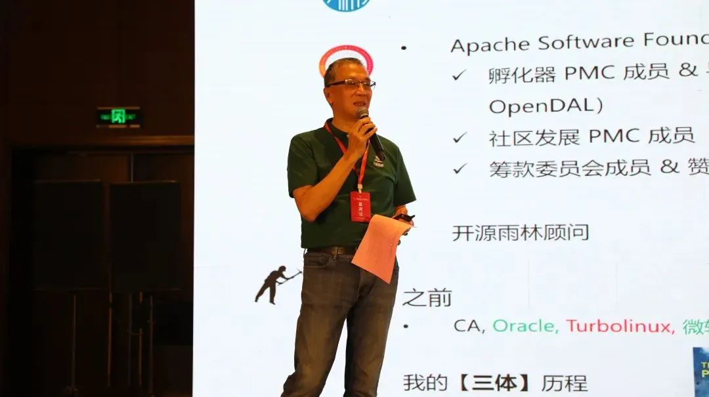
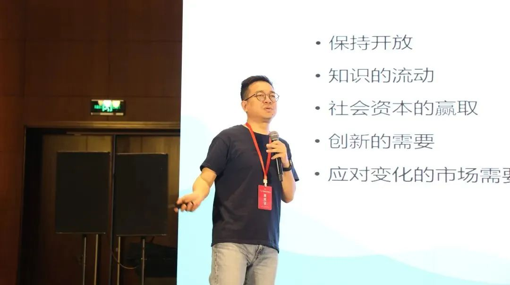
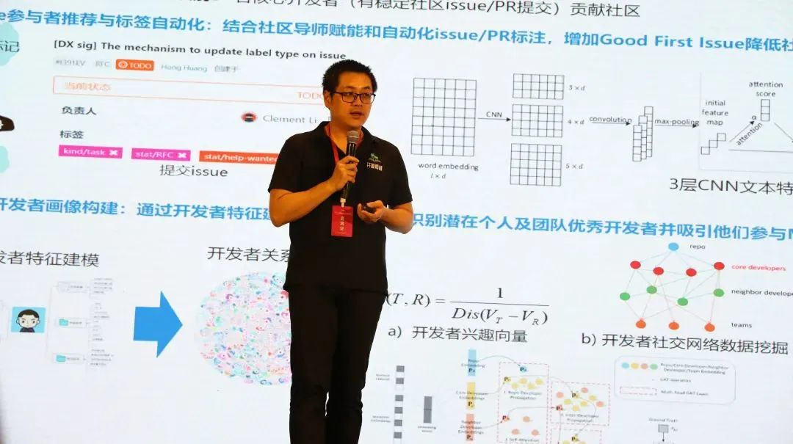
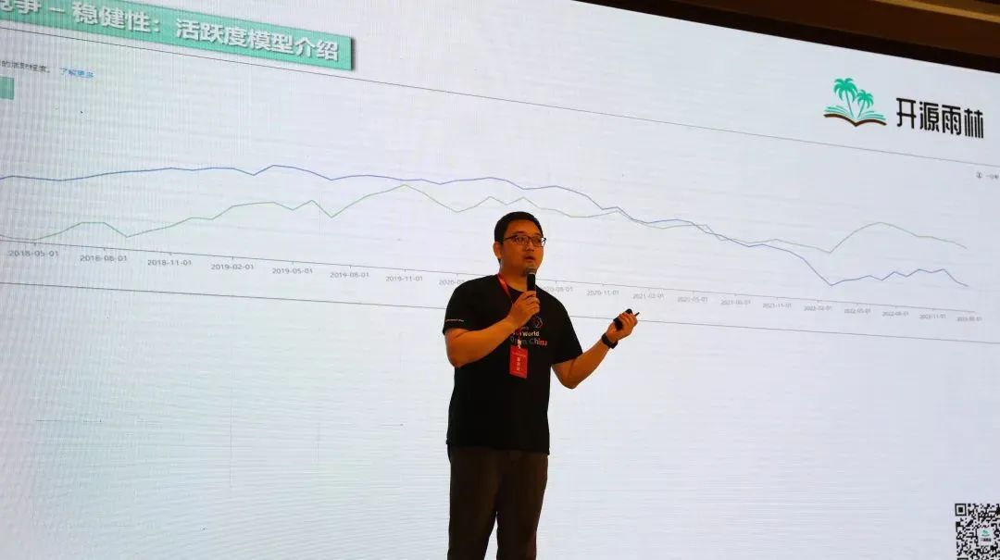
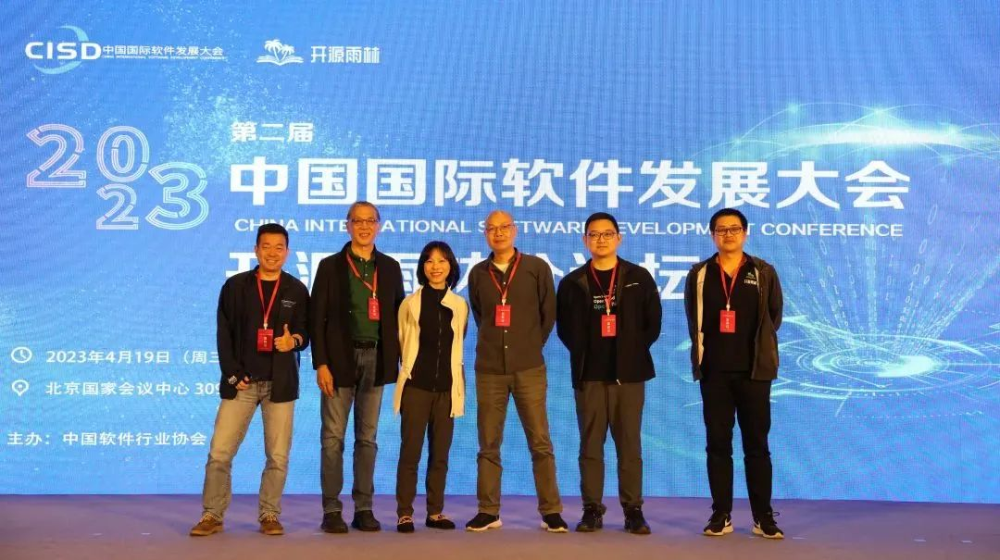

以下文章来源于开源雨林 ，作者开源雨林

4 月 19 日上午，第二届中国国际软件发展大会开源雨林分论坛在北京国家会议中心成功举办。

<!--truncate-->

中国软件行业协会付晓宇副秘书长在致辞中表示，开源雨林计划是一次全新尝试，它从开源通识、开源使用、开源贡献三大方面构建了开源课程体系。也希望华为充分发挥自身技术和经验优势，在团队、机制、项目方面提供咨询服务，协助企业构建开源能力中心，逐步提升全行业开源技术水平，推动我国从开源使用大国向开源贡献大国迈进。

开源雨林社区顾问刘天栋在分论坛上对开源雨林项目的整体情况作了详细的介绍，并重磅发布开源雨林 5 门课程——《开源生命周期管理》、《开源合规及其风险管理》、《开源生态构建及业界优秀实践》、《开源安全及其风险管理》及《企业开源的战略和战术》。为让开源成为企业发展原动力，开源雨林联合华为 EBG、信通院完成课程的开发与赋能，通过构建开源知识体系，赋能企业开源。目前，开源雨林企业开源赋能课程已发布 9 门，还有 2 门专注于开源使用及开源生态构建的内容正在开发中。

「开源之道」主创适兕从组织理论视角阐释了企业为什么需要开源，从属性、文化、版权等角度比较了企业特性跟开源 community 特性的差异。开源从全球来看仍属于亚文化，对于开源背后的理论、逻辑、底层原理还需要做大量普及，需要建立秩序，才能把开发者、参与者激活，共同参与到开源项目中来。

华为工程师高琨解读了华为开源社区工程治理实践：一是开源社区可信能力框架，探索可信社区完整框架，打造 openEuler 可信标杆社区，影响整个供应链。二是开发基础设施框架及构建，重点补齐代码检查、测试管理、流水线与构建能力。三是运营框架及开发者体验，通过对社区不同人群活动和痛点分析，制定社区体验 6 大解决方案，吸引和留存开发者用户，扩大开发者生态，精准运营 MVP/核心开发者/社区开发者。四是评估度量，包括生产力、稳健性和创新力三大维度。

LF CHAOSS Board、OSS Compass TC co-chair 王晔晖做《OSS Compass 开源生态评估体系解读与实践》主题演讲，对 OSS Compass 开源生态评估体系做了详细的介绍，OSS Compass 提供公开的 SaaS 服务，只需输入 GitHub 或 Gitee 托管平台上的仓库名称或社区名称，即可全面展示该仓库或项目的健康状态。并举例展示了 Apache bRPC 项目通过 OSS Compass 生成的数据指标报告，通过模型及指标帮助社区全方位了解当下现状及未来可能的发展趋势。

SphereEx 联合创始人 & CTO 潘娟分享了 Apache ShardingSphere 建设 global 社区探索与成长案例，分析了开源社区如何从 idea 到起步再到发展为成功商业项目的成长轨迹，以及价值、方向、传播、基建、规则、人员等因素在其中发挥的重要作用。

本次分论坛从理论到实践贯穿首尾，从知识体系构建与推广、组织理论、社区运营治理、项目开发管理、社区健康度评量，到成功商业项目案例，“端到端”分享了开源领域经验，符合开源雨林「企业开源的最佳伙伴」的定位，欢迎大家持续密切关注开源雨林的精彩内容！

文字 | 王瑶  
校对 | 刘天栋  
出品 | 开源雨林
