全球开源技术峰会 GOTC 2023 于 5 月 27 日至 28 日在上海张江科学会堂成功举办。其中，OSS Compass 开源生态健康评估分会场备受瞩目。

<!--truncate-->

该分会场的主要内容涵盖了 OSS Compass 开源生态评估体系的理论解读、模型解读与新功能发布。南京大学计算机科学与技术系副教授、硕士生导师、OSS-Compass TC Co-Chair 汪亮从理论角度出发，深入浅出地介绍了 OSS Compass 评估体系的相关理论知识和即将发布的开发者里程模型，向与会者展示了如何从多个角度对开源生态进行全面评估，为开源生态的健康发展提供了重要的理论支持。

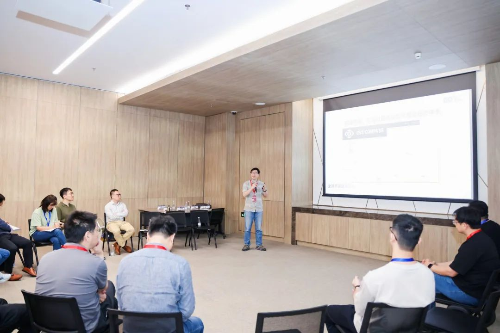<small style={{ fontSize: '12px', textAlign: 'center' }}>
汪亮《OSS Compass 开源生态评估体系理论解读》</small>

华为 2012 实验室-开源管理中心工程师、LF CHAOSS Board、OSS-Compass TC Co-Chair 王晔晖作为主讲人，他分享了 OSS Compass 模型解读与新功能发布，详细介绍了洞察报告订阅系统、开发者里程模型和 Compass lab 新功能等内容。这些新功能的发布将进一步提升 OSS Compass 的评估能力和分析深度，为开源生态的健康发展提供更加全面的支持。

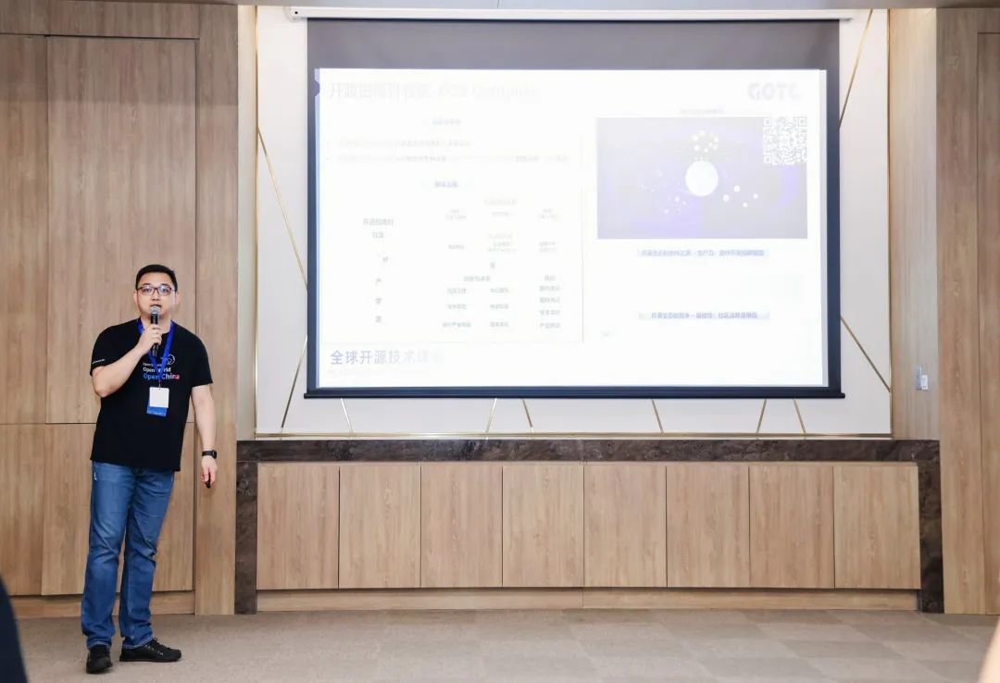<small style={{ fontSize: '12px', textAlign: 'center' }}>
王晔晖《OSS Compass 模型解读与新功能发布》</small>

最后，圆桌会议环节邀请了前华为开源管理中心开源治理专家、现担任开源社理事、执行长庄表伟，中国信息通信研究院开源产业研究员张一阳，上海安势信息技术有限公司首席数据科学家王佳磊，字节跳动开源委员会开源法务孙振华等多位业内专家参与。他们就开源社区健康评估展开了深入讨论，为开源专家学者点亮运营、治理的明灯。

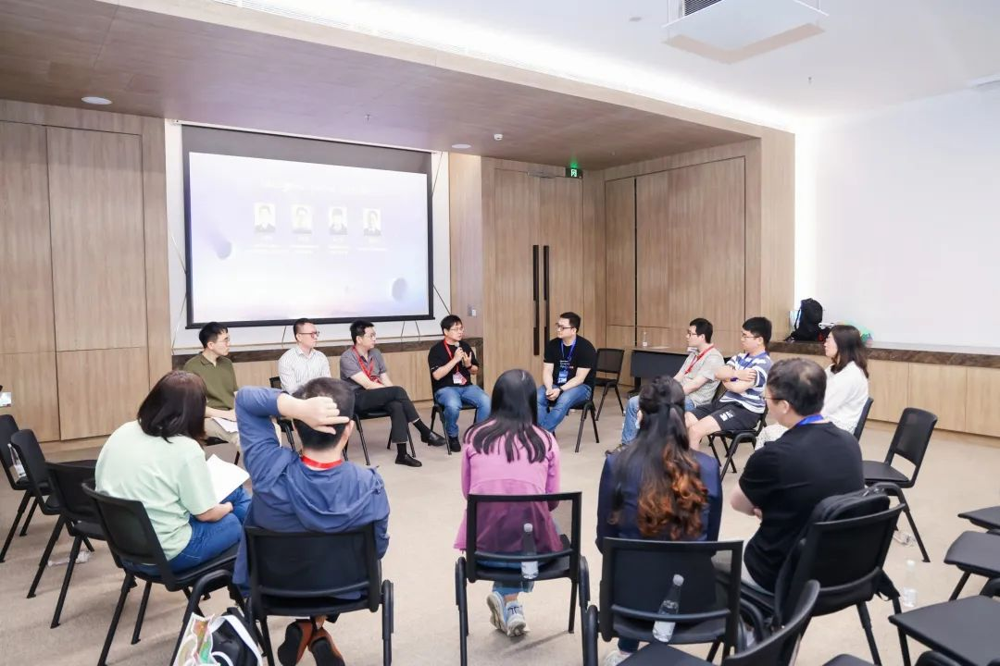<small style={{ fontSize: '12px', textAlign: 'center' }}>
圆桌会议—开源社区健康评估，为你的运营、治理点亮明灯</small>

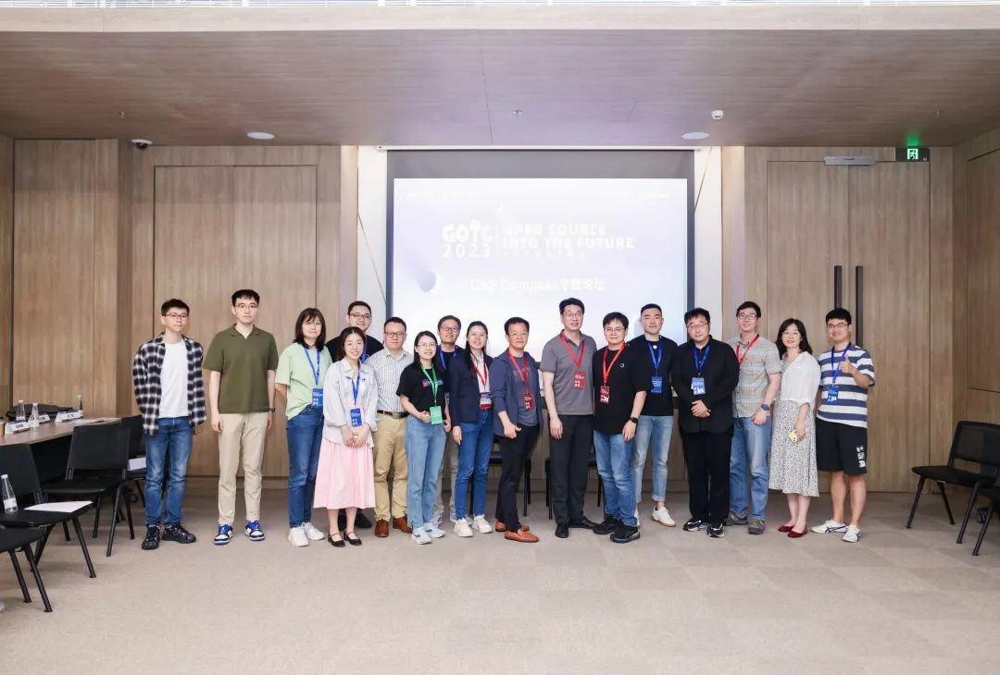<small style={{ fontSize: '12px', textAlign: 'center' }}>
主要与会人员合影</small>

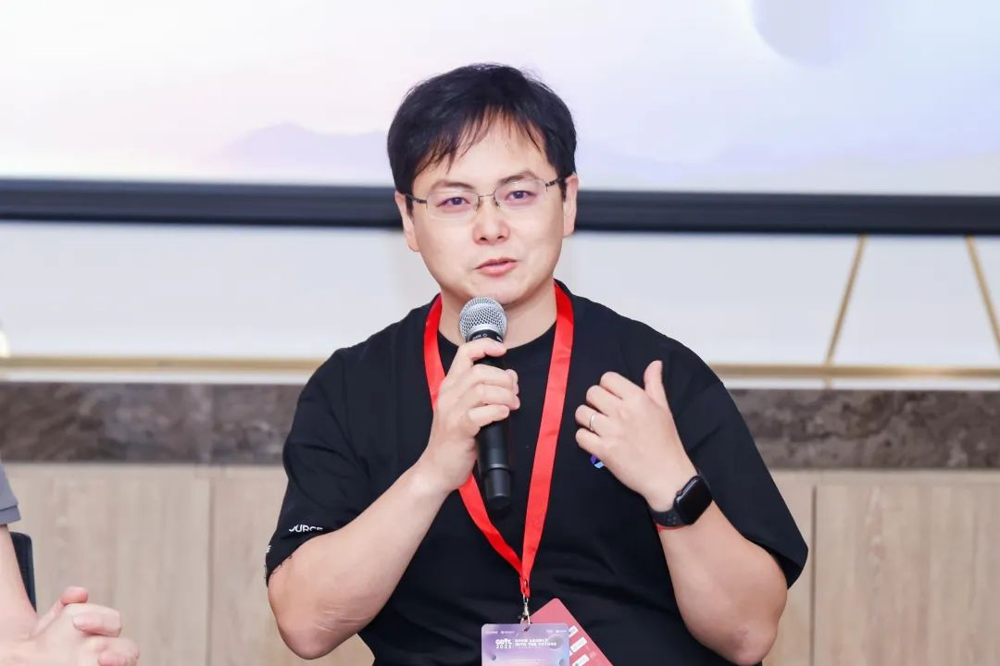 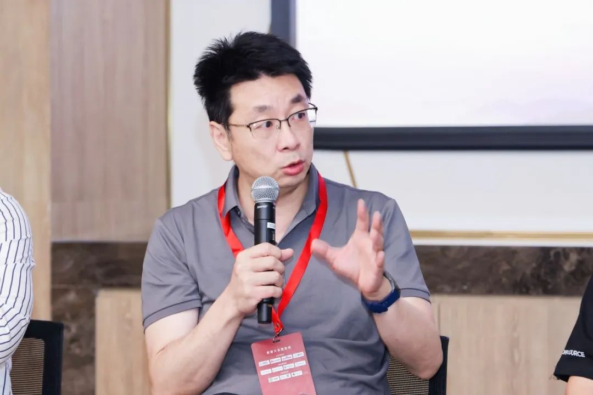 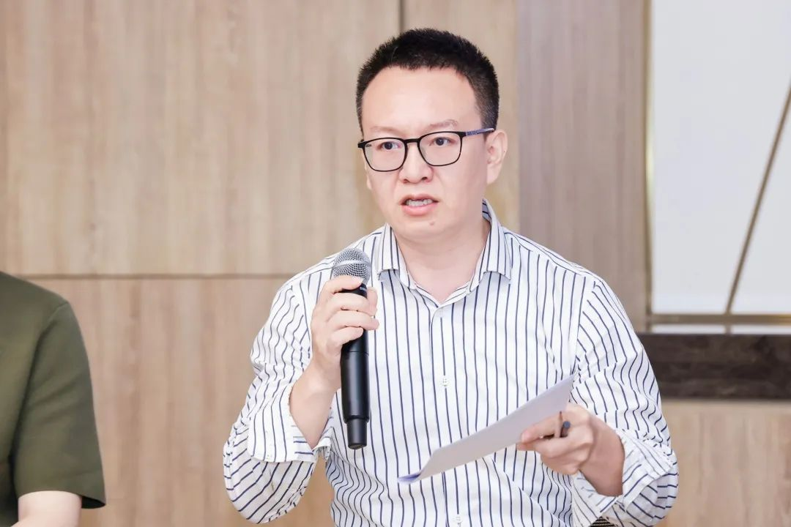
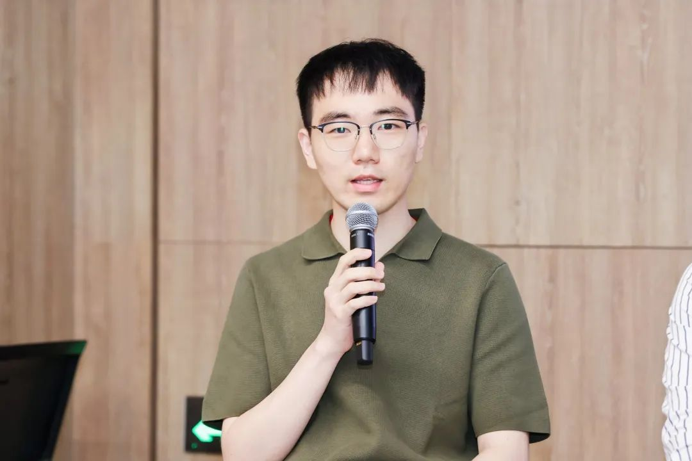 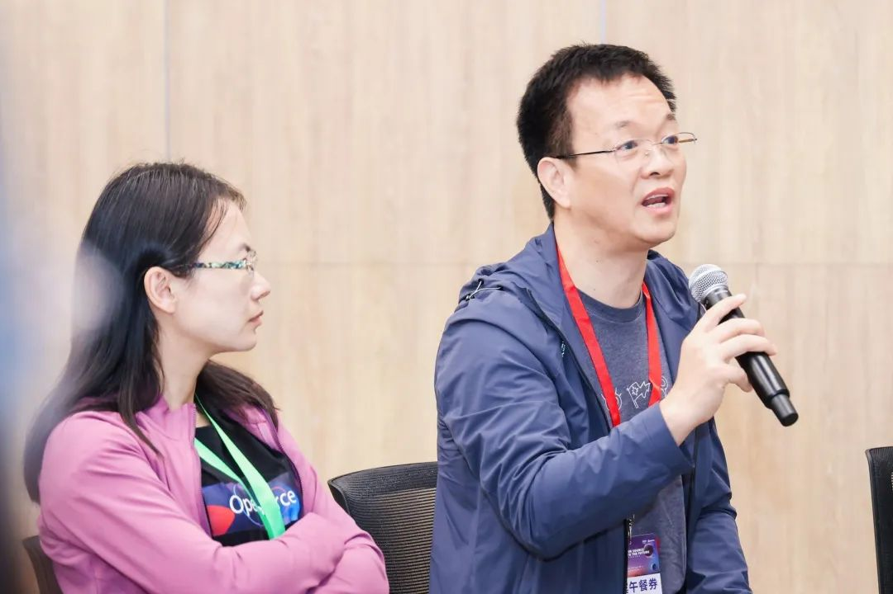 
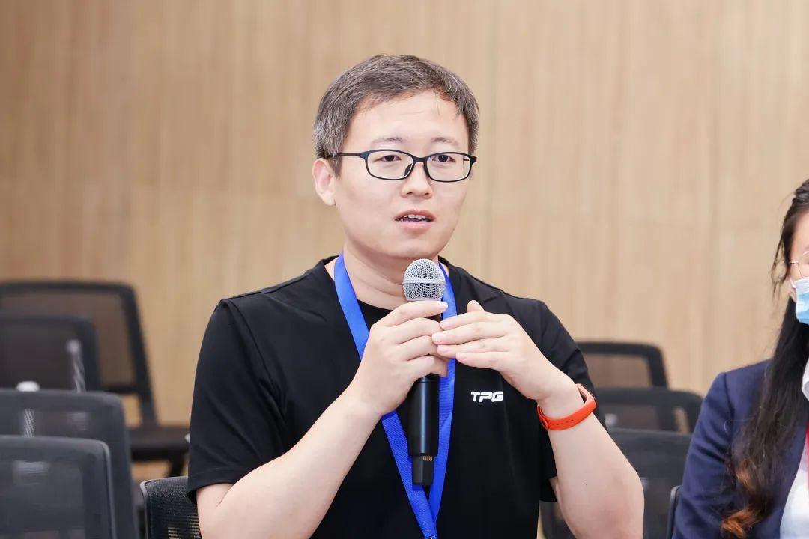 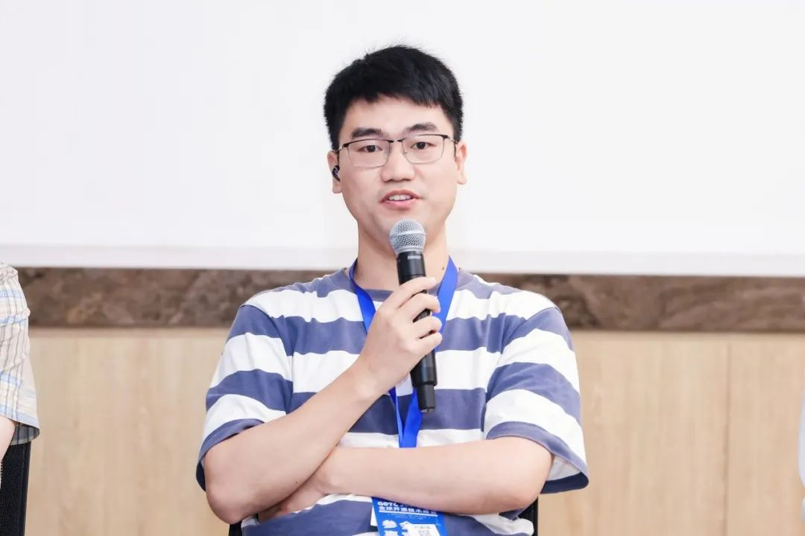 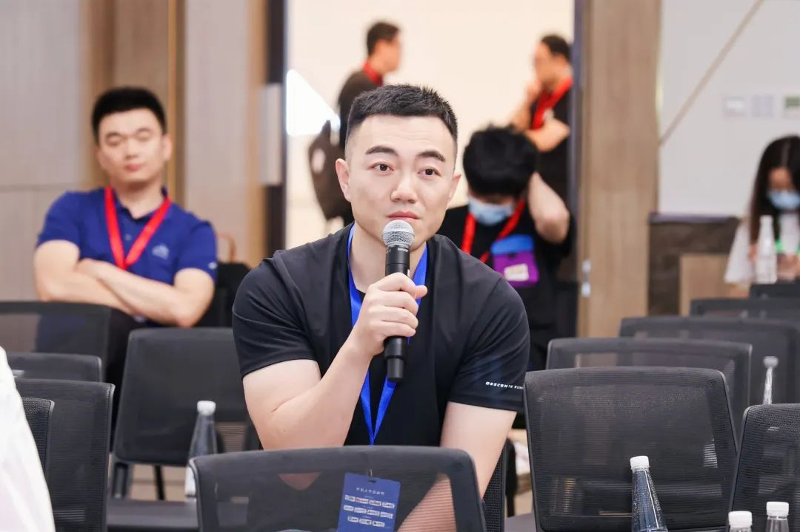

如果你对 OSS Compass 开源生态评估体系和模型有兴趣，可以点击原文访问 https://wj.qq.com/s2/12430808/ef24/ 填写用户调查问卷，也可以通过访问 OSS-Compass 官网点击右下角的问卷图标或者微信公众号参与问卷调查，分享你的看法和建议。同时可以点击以下链接下载王晔晖和汪亮的演讲 PPT。

汪亮-OSS Compass 开源生态评估体系理论解读：
https://compass.gitee.com/docs/assets/files/GOTC-%E6%B1%AA%E4%BA%AE-364bd924e8e4b2d49d903e6ac7b9660b.pdf

王晔晖-OSS Compass 模型解读与新功能发布：
https://compass.gitee.com/docs/assets/files/GOTC-%E7%8E%8B%E6%99%94%E6%99%96-caab3c497c34e04dc53d1c62feb4d454.pdf
