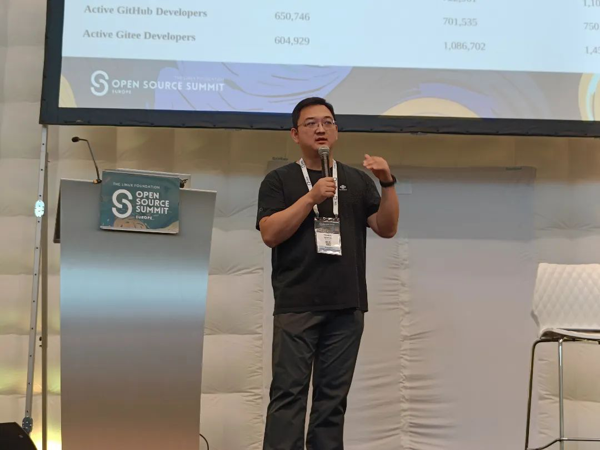
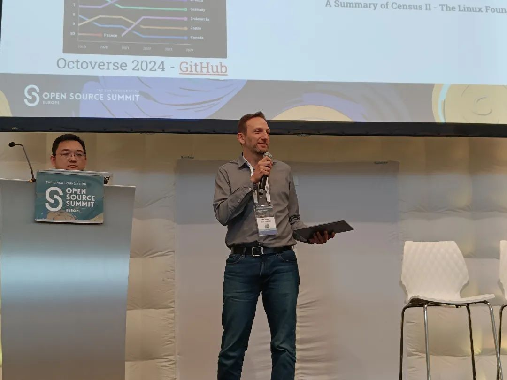
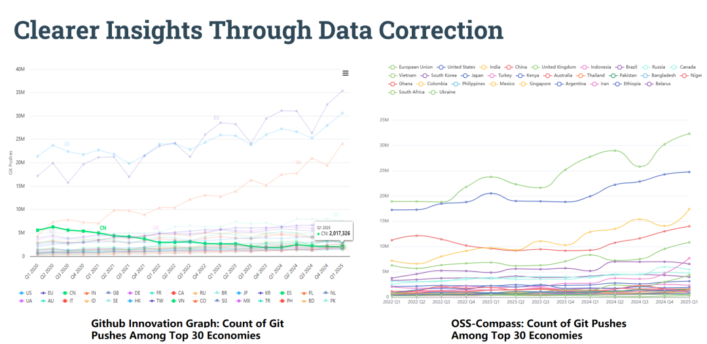
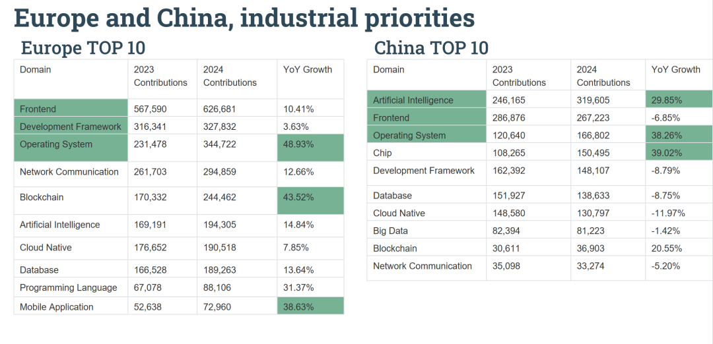

2025年8月25日-8月27日，Open Source Summit Europe 2025在阿姆斯特丹成功举办，OSS-Compass 受邀参会。8月27日，OSS-Compass 技术委员会联席主席王晔晖和 Bitergia CEO Daniel Izquierdo Cortázar在 Keynote 上发表主题演讲: Europe-China Open Source : Digital Sovereignty & Sustained Collaboration（中欧开源：数字主权与持续合作）。

<!--truncate-->

演讲中，王晔晖和 Daniel Izquierdo Cortázar 围绕地缘政治变化下欧洲与中国开源生态系统发展，由以下几方面进行展开分享。

指出目前开源已成为关键战略，尽管欧美开发者密度众所周知，但他们与中国生态系统的联系仍未得到充分探索。展示了2020-2025 年全球 TOP30 国家与地区的开源贡献趋势，分析了 GitHub 地理数据因 VPN 及其他更改或隐藏IP的手段导致的数据失真问题，并提出当前面临的挑战：数据源不丰富、数据体系不健全、数据失真、数据获取困难等问题。对此，OSS-Compass 通过跨平台统计（含 GitHub 并引入 Gitee 数据源）、时区验证等改进数据准确性的方法，并展示了修改之后的数据差异情况。

2024年，OSS-Compass 为由开放原子开源基金会主编的《中国开源发展深度报告（2024）》提供了核心数据支持。详细对比欧洲、中国的人口、GDP、ICT 员工数等基础指标及开源贡献量（欧洲 9253 万次提交、中国 5034 万次）、活跃项目数（欧洲 560 万、中国 303 万）等核心数据，另外展示两地各技术领域的贡献变化及全球开源进出口贡献分布。从数据可得出欧洲已成全球开源协作引领势力，但中国开源项目和开发者也具备极大潜力。最后根据数据分析显示，欧洲在操作系统、前端、移动应用等成熟领域领先，中国在 AI、半导体、操作系统等领域突出的现状，提出两者正形成互补生态的市场合作路径。

OSS-Compass 社区的蓬勃发展离不开社区开发者的持续贡献和努力。面向未来，OSS-Compass 将以创新为导向，持续迭代技术能力与服务体系，为更多用户提供更贴合开源生态需求的强大工具与解决方案。我们也诚挚邀请所有关注中国开源生态、有志于参与生态研究与协作的伙伴加入，期待与您携手探索中国开源生态的发展路径，共同推动生态的繁荣与进化。
