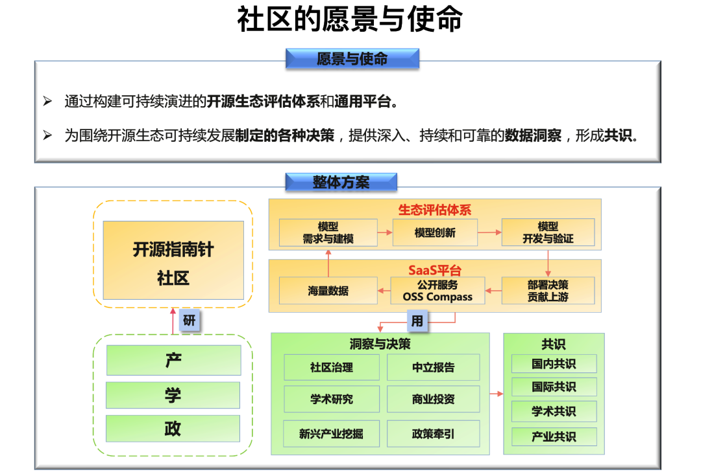
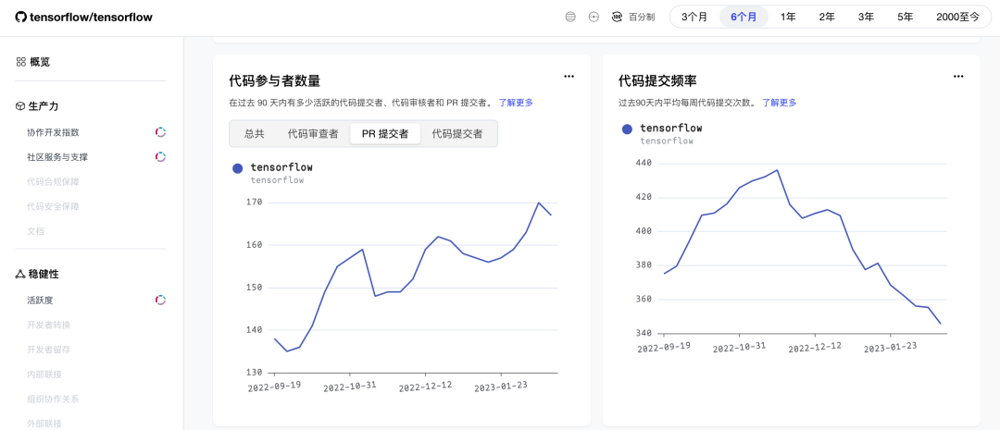
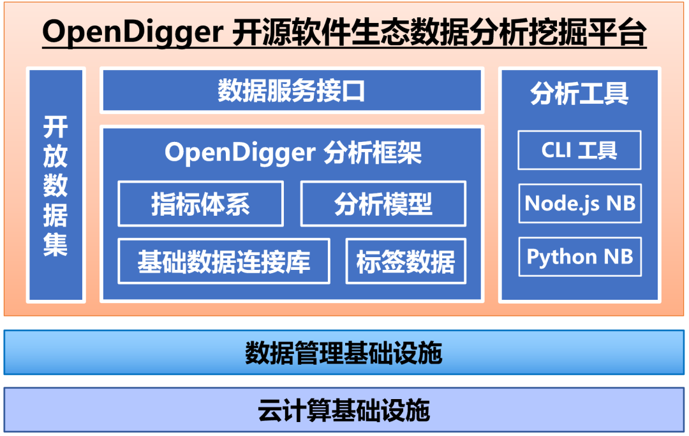

近日，开源生态健康评估平台 OSS Compass 与开源生态数据挖掘分析平台 OpenDigger 达成共识与合作，双方将在开源数据挖掘和开源健康评估标准等方面进行深入探讨与研究，并通过开源共建的方式，为业界提供更加权威、中立、公正、全面的开源评估体系与平台。

<!--truncate-->

> <small>
>   由左至右：OSS Compass Board 成员红薯，华东师范大学教授/X-lab
>   开放实验室创始人王伟，开源社理事/执行长庄表伟，同济大学计算机博士生/X-lab
>   开放实验室核心成员赵生宇
> </small>

开源产业正在高速发展，如何高效、准确地评价一个开源社区，一个开源项目，一个开源生态的价值和潜力，让用户能够在数以百万计的项目里快速找到最适合自己的项目，实际上是一个巨大的挑战。尽管当前有不少的度量体系，但在系统性、通用性、应用性方面仍然存在不足。  
2023 年 2 月 21 日，国内首个用于开源生态健康评估的平台 OSS Compass 开源指南针正式对外发布，并面向 GitHub、Gitee 等平台所有开源项目开放。OSS Compass 提供公开的 SaaS 服务，只需输入 GitHub 或 Gitee 托管平台上的仓库名称或社区名称，即可全面展示该仓库或项目的健康状态，使用简单，展示清晰。

除了开源项目本身的发展健康外，其项目和成员的相关数据趋势对生态健康也是至关重要的，在这方面 OpenDigger 社区拥有十分丰富的经验。OpenDigger 是由 X-lab 开放实验室发起，开源社 ONES Group 联合共建，集数据采集、数据分析、数据建模、数据服务于一体的开源领域数据分析与服务项目，这个项目旨在从全域的角度对分散的开源相关数据进行数据捕捉和分析，通过图的方式构建开源知识图谱，让开源项目的发展和健康有了更加宏观的展示视角。  
OpenDigger 已经为《GitHub 数字洞察报告》、《中国开源年度报告》等行业级报告提供坚实的数据支撑，本次 OSS Compass 与 OpenDigger 的合作，将会进一步加强 OSS Compass 的数据收集和分析能力，为开发者们判断开源生态健康提供了更多高可信度的依据。

除了 OpenDigger 外，OSS Compass 也正在积极地与更多评估体系达成合作，让 OSS Compass 的能力始终保持领先水平。在积极与行业内评估体系合作的同时，OSS Compass 作为一个开源项目本身，从诞生起就凝聚了众多开发者的智慧，并围绕该项目形成了开源开放的社区，OSS Compass 社区也会始终坚持开源开放，欢迎广大开发者参与到 OSS Compass 的建设中来，让我们共同为推动我国开源与软件产业发展，推动国内开源生态健康发展努力！
