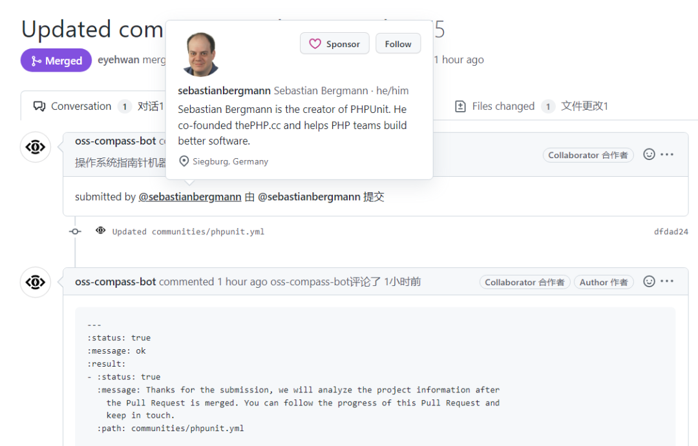

轻量级 PHP 测试框架 PHPUnit 的作者 Sebastian Bergmann 已将该项目的信息上传到 OSS Compass 开源生态评估平台，用于对 PHPUnit 的社区生态进行状态评估。

相关 Pull Request 地址：https://github.com/oss-compass/compass-projects-information/pull/275

<!--truncate-->

### 什么是 PHPUnit

PHPUnit 是一个流行的轻量级 PHP 测试框架，是 xUnit 测试框架家族的一员（基于模式先锋 Kent Beck 的设计）。

作为 PHP 应用程序开发中最常用的测试工具之一，PHPUnit 可以帮助开发人员快速、高效地编写和执行各种类型的测试（包括单元测试、功能测试和性能测试），从而提高应用程序的质量和可靠性。

PHPUnit 提供了一组用于测试 PHP 代码的 API，包括断言（assertions）、测试套件（test suites）、测试用例（test cases）和测试运行器（test runners）。使用 PHPUnit，开发人员可以编写测试用例来模拟应用程序的各个方面，包括数据库、Web 服务、API 等。

PHPUnit 还提供了一些高级功能，如代码覆盖率分析、数据提供者、测试依赖项和测试固件等。这些功能可以帮助开发人员更轻松地编写和执行复杂的测试，并确保应用程序的质量和稳定性。
