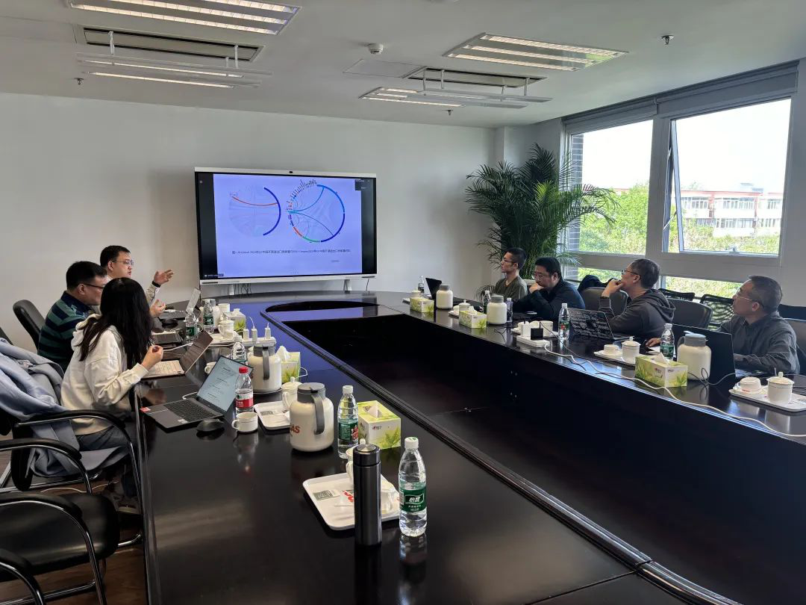
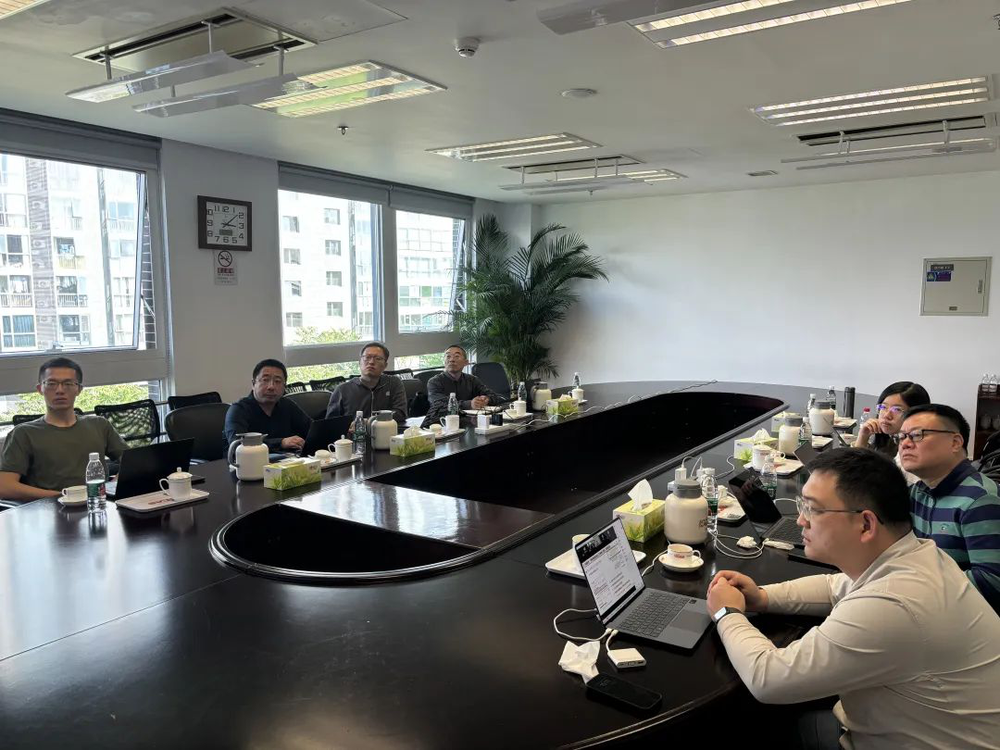

2025 年 4 月 25 日下午，OSS-Compass（以下简称“Compass”）社区 2025 年 Board 会议在中国科学院研究所顺利召开。本次会议共 11 位 Board 成员参会，其中国家工业信息安全发展研究中心软件所周峻松、百度马红伟、中国科学院软件研究所梁冠宇、北京大学邱睿桥、华为马全一、王晔晖，奇科厚德龙文选现场参会，另外南京大学陶先平、汪亮，开源中国红薯、张盛翔线上参会，共同开启这场开源社区发展的深度探讨之旅。

<!--truncate-->

### 一. Board 新成员选举

会议开始，社区 Board 新成员选举流程正式启动。由中国科学院软件研究所梁冠宇详细介绍了中国科学院软件研究所的科研实力与创新成果，并深入阐述了与 Compass 社区的合作项目规划，他的申请提案获得全体与会成员一致认可，全票通过。至此，梁冠宇正式代表中国科学院软件研究所加入 Compass 社区大家庭，这将为 Compass 社区发展注入全新活力，也为双方未来在开源领域的深度合作奠定坚实基础。

### 二. 2024 年社区工作回顾

Compass 社区董事会成员及技术委员会联席主席王晔晖、汪亮向各位理事会成员汇报了 Compass 社区 2024 年的主要进展情况：

1. **权威报告助力行业洞察**
   2024 年，Compass 社区协助开放原子基金会精心筹备《中国开源发展深度报告（2024 年）》，目前该报告预计 5 月正式发布；另外 Compass 还携手南京大学陶先平老师、汪亮老师团队，对全球开源生态进行深度研究，通过分析全球开源贡献量、进出口贡献量格局、活跃项目与开发者动态、技术领域焦点分布，以及基于 GitHub 与 OSS-Compass 双源数据对比中国开源生态差异，深度剖析开源项目活跃性与认可度，精准识别中国开源项目的机遇与挑战，为国内外开源发展提供极具价值的参考依据。

2. **开源软件选型智能化推荐、高潜开发者挖掘与推荐**
   南京大学汪亮老师围绕 “贡献者画像与推荐技术” 及 “三方库画像与推荐技术” 两大核心主题展开专业分享。针对开源生态建设的实际需求，以鸿蒙生态三方库等关键项目为研究对象，构建了智能化贡献者推荐系统。该系统通过对开发者技术能力与贡献意愿的深度画像，并结合机器学习模型，实现对高潜力开发者的精准识别。系统基于海量开发者数据，全面刻画开发者技术活跃度、跨项目情感分布等多维特征；同时，在三方库推荐技术研发方面，创新性地运用多层图模型，深度融合功能相似性、替换关系等语义特征，显著提升推荐准确率。未来，该功能将同步至 Compass 平台，助力平台在开源生态建设中发挥更大价值。

### 三. 2025 年社区规划

面对充满机遇与挑战的 2025 年，Compass 社区已制定了清晰的发展规划：

1. **SaaS 服务矩阵升级**
   在 SaaS 服务层重磅推出五大核心服务，涵盖开源态势洞察服务、社区生态评估服务、开发者画像服务、开发者选型评估服务等领域。通过整合社区数据资源与技术优势，为用户提供一站式、智能化的开源服务解决方案，助力企业与开发者精准把握开源趋势，提升开源项目管理与决策效率。

2. **镜像站生态构建**
   推进 OSS-Compass 镜像站服务建设，计划在国内高校、研究机构等学术阵地上线平台镜像站点。通过打造稳定、高效的数据共享平台，推动 OSS-Compass 成为学术研究、政策分析与制定的数据引擎，进一步提升社区在学术界与产业界的影响力。同时，强化 AI 节点能力建设，为智能化服务方案落地提供坚实技术保障。

3. **深化多方合作共赢**
   持续深化与国家工业信息安全发展研究中心软件所、开放原子基金会、中国科学院软件研究所、北京大学、南京大学、开源中国等组织与高校的合作关系。通过资源共享、技术协同、联合创新等合作模式，共同攻克开源领域关键技术难题，推动开源生态健康、可持续发展。

### 四. ISO 国际标准合作倡议书

王晔晖表示，2025 年 Compass 社区将聚焦国际标准研究与应用，联合中国、欧美 20 余家企业，共同推动社区可持续发展维护标准的制定。同时，在 Compass 平台所有指标和模型定义页面增设 “Try me” 链接，为用户提供更便捷的标准实践入口，提升社区在国际开源标准领域的话语权。

### 五. AI 工作组建设规划及研讨

随着人工智能技术的蓬勃发展，2025 年也被视为大模型发展的关键之年。Compass 社区敏锐捕捉行业趋势，由 Compass 社区 Maintainer、华为高级工程师齐国强主导发起并建立 AI 工作组，深度探索 AI 技术与开源业务的融合应用。通过搭建技术交流与创新平台，汇聚社区内外 AI 领域专家与开发者智慧，为开源创新注入强劲动力。

### 六. 2025 年 6 月社区年会规划

此外，2025 年 6 月，Compass 社区将在北京大学举办年度峰会。届时，社区将围绕全新推出的五大 SaaS 服务展开深度研讨，并邀请业内权威专家、企业、高校代表与开发者共聚一堂，分享开源实践经验，共话开源未来发展。

此次 Board 会议的圆满召开，为 OSS-Compass 社区未来发展指明了方向。站在新的起点上，未来 OSS-Compass 社区将携手全体成员，以创新为驱动，以合作促发展，共同书写开源事业新篇章！

