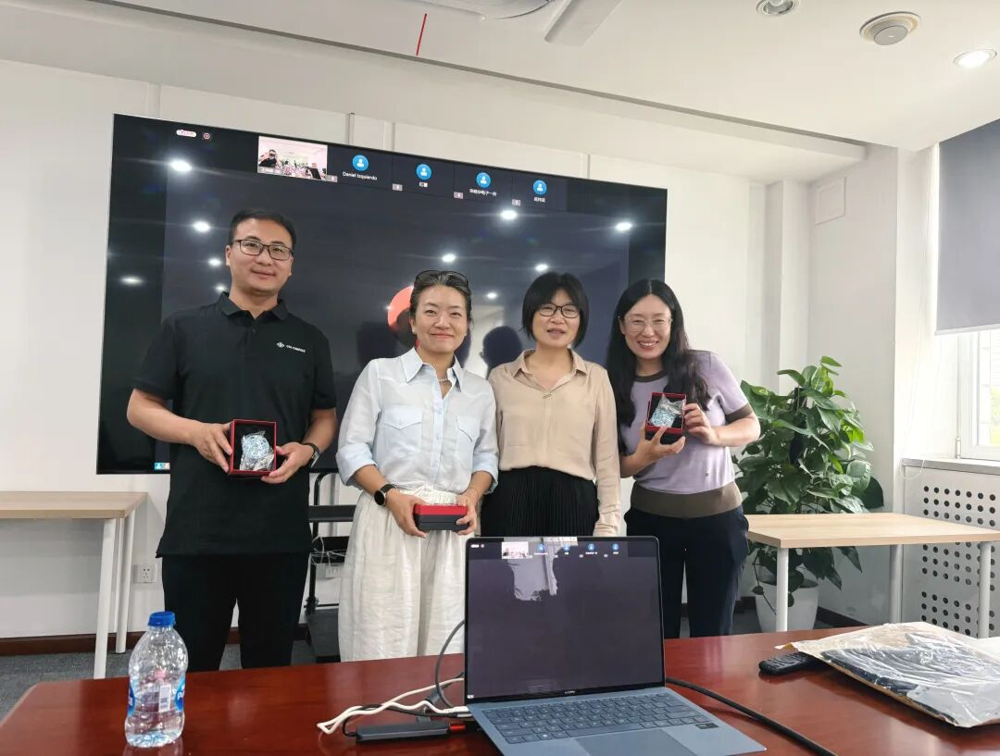

2026年6月2日下午，OSS-Compass 社区2026年Board会议在中国科学院软件研究所圆满召开。会上，参会成员围绕人才共建、模型迭代、开发者体验升级、大模型合规体系搭建等核心议题深度研讨，共同敲定社区年度重点工作与长远发展规划。

<!--truncate-->

本次会议共16位 Board 成员参会，参会人员分别为：北京大学周明辉、南京大学陶先平、汪亮，浙江大学倪超、中山大学郑子彬（吴炜滨代替）、国家工业信息安全发展研究中心软件所许智鑫、中国电子技术标准化研究院杨丽蕴、中国科学院软件研究所梁冠宇、中国信通院郭雪、OpenUK Daniel Izquierdo、开源中国红薯、张盛翔，奇科厚德龙文选、百度马红伟、华为马全一、王晔晖。

### 一、Board 新晋成员选举

本次会议开展了 Board 新晋成员选举工作，五位来自行业标准机构、顶尖高校、国际开源组织的权威专家成功入选，经全体与会成员审议表决，提案全票通过，正式加入 OSS-Compass 社区理事会，为社区生态建设注入全新的专业力量。（以下按发言顺序排列）

#### 1. 中国电子技术标准化研究院软件中心开源研究室主任 杨丽蕴

杨丽蕴主任深耕云计算与开源领域标准化工作多年，推动开源标准体系建设，主持研制发布多项开源领域国家、行业和团体标准，深度参与多项国际开源组织、委员会核心工作，持续推动开源治理标准的落地实践。未来，她将重点推进OSS-Compass 指标体系的国际标准化建设，依托自身研究积累与行业合作资源，深化与各类国际开源组织的联动协作，助力 OSS-Compass 体系走向国际。

#### 2. 中国信通院云计算与数字化研究所开源和软件安全部主任 郭雪

郭雪主任长期深耕开源产业领域，核心参与开源政策支撑、行业标准研制、产业生态研究等重点工作，牵头落地多项重点开源项目标准化建设。加入 OSS-Compass 社区后，她将深度参与社区项目评估体系、核心模型的搭建优化，充分发挥平台桥梁价值，推动 OSS-Compass 成果落地产业端、政务端，助力央国企开源选型、地方政府开源生态建设。同时，将联动自身标准组织、行业社区、智能体开源社区资源，与 OSS-Compass 建立常态化合作机制，协同推进开源治理体系完善与核心技术迭代。

#### 3. 浙江大学软件学院副教授 倪超

倪超教授团队长期深耕开源生态领域，主攻智能化软件质效保障关键技术，同步深耕高校开源人才培育与产学研技术创新。团队自主研发“[太乙平台](https://www.taiyi.top)”，搭建起高校、产业企业与开源社区三方联动枢纽，助力开源教育落地推广。针对高校人才培养导向与企业实际人才需求脱节痛点，平台依托学科竞赛、定制课程、专题实践活动等多元载体，打通学生对接企业与开源社区的渠道，切实锤炼学生实操能力，提高学生开源项目参与积极性。倪超表示，团队后续将联合 OSS-Compass 社区持续扩容开源赛事布局，紧扣产业落地需求精准培育高水平开源人才，充分释放高校开源科创内生动力。

#### 4. OpenHQ Researcher、Linux 基金会 CHAOSS 理事成员 Daniel Izquierdo

Daniel Izquierdo 长期深耕全球开源领域，深度参与多个国际顶级开源组织工作，专注开源开发模式与全球开源生态应用研究。他在会议中重点强调了全球开源协作的核心价值，指出开源技术能够为政府、企业、社会数字化建设提供核心支撑。他期待与 OSS-Compass 建立深度、稳定的合作关系，通过跨地域数据共享、联合搭建评估模型等方式，助力全球开源技术可持续、规范化发展。

#### 5. 中山大学软件学院院长 郑子彬

郑子彬院长聚焦大模型合规评测领域，未来加入社区后，他将依托开源基金会中立属性与海量开发者生态，搭建产学研协同的可信大模型评测标准体系。同时，将通过共享标准底座、投入核心研发人力、组织生态交流活动等方式，全力推动大模型评测指标、核心算法及评测平台的落地应用。

### 二、评估模型工作组进展汇报

会上，OSS-Compass社区董事会成员、技术委员会联席主席王晔晖带来评估模型工作组最新工作进展。他围绕AI技术普及、开源社区身份管理难题两大核心背景，深入剖析了新时代下开源社区发展、软件工程建设面临的全新变革与挑战。他指出，AI驱动的开发模式正在重塑开源行业规则，传统的开源治理规则、基础设施架构、评估体系、工程建设体系均迎来迭代升级需求。基于行业现状，工作组明确了后续核心工作方向：聚焦AI时代开源治理痛点，优化适配智能化场景的治理规则与基础设施，迭代升级开源评估体系与工程体系，同时探索全新产学研合作模式与智能化评估工具研发方向，全方位适配AI驱动的开源开发新生态。

### 三、AI 工作组进展汇报

OSS-Compass 社区 AI 工作组负责人齐国强针对开发者体验评估平台的研发与落地成果进行汇报，详细拆解平台技术架构、核心评估模型、任务编排机制及未来迭代规划。他提出，该平台立足开发者社区全流程参与场景，凝练出六大核心参与旅程，搭配精细化测评任务，全方位评估开发者的项目参与体验与开发效率。平台采用轻量化、模块化设计，可将复杂测评任务拆解为多个独立节点，通过智能编排机制生成专属评估计划，完成任务执行后自动输出专业测评报告。目前，平台已精准识别开源开发者参与过程中的多项核心问题，实现问题动态跟踪、实时更新，同时支持开发者在线交互反馈，大幅提升平台实用性。未来，工作组将持续融入前沿AI技术，持续提升平台智能化、精细化评测能力。

### 四、开源大模型合规工作组成立

本次会议正式成立开源大模型合规工作组，华为高级工程师闫宣辰牵头分享工作组核心规划与建设目标，围绕版权、隐私、安全、价值四大核心维度，深度剖析当前开源大模型合规评测的行业现状与核心痛点。他指出，当前国内开源大模型合规评测体系仍存在诸多短板：测试集来源透明度不足、地域适配性较弱、模型缺乏合规专项微调、评分标准单一片面等问题，严重制约行业规范化发展。

针对以上痛点，工作组明确核心建设方向：打造一套开放中立、可复用、可落地的开源大模型合规标准，联合高校、科技企业、开源社区多方力量，推进合规算法工程化落地。同时将分阶段完成合规评测平台搭建、迭代与推广，积极布局国际化标准建设，最终形成全行业通用、认可度高的大模型合规评测体系，全面提升开源大模型在版权、隐私、安全等领域的合规水平与可信度。

本次 OSS-Compass 社区2026年Board会议的圆满落幕，不仅为社区吸纳了顶尖的产学研用核心力量，更明确了 AI 时代开源社区技术创新、合规发展的未来路径。

未来，OSS-Compass 将持续汇聚高校、科研院所、头部企业、国际开源组织的优质资源，坚守开放、中立、共建的开源初心，持续完善开源评估体系、创新技术赋能模式、筑牢行业合规底线，助力国内开源生态规范化、智能化、国际化发展。

