### 2023 年社区重要进展

**1. 社区用户：**截至 12 月，官网总活跃用户 1.5 万+，覆盖 90+ 国家和地区，TOP 3 是中国、美国、日本，境外用户超过 30%。

**2. 国际合作：**与 CHAOSS 建立合作伙伴关系，CHAOSS 将在 2024 年完成部署 OSS Compass 的 SaaS 服务。

**3. 产业合作：**OSS Compass 全量替换 Gitee 指数，对接 3000 万 + 开源项目；国内企业 OSPO 使用 OSS Compass 开展社区治理与运营工作；助力艾瑞咨询发布《2023 中国基础软件开源产业研究白皮书》；助力 COPU 发布《2023 中国开源发展蓝皮书》。

**4. 政府合作：**为一所主导的“开源社区发展提质行动”提供数据支持。

**5. 学术合作：**北京大学、南京大学共 6 个学术成果落地社区；支持南京大学学术研究，发表 CCF-A 会议论文 1 篇，投稿 CCF-A 期刊论文 1 篇。

<!--truncate-->

### Part1。社区价值

**用户增长**

2023 年 1 月到 12 月：

OSS Compass 官网总用户数 1.5 万+，

新增 1 万 + 用户，月平均活跃用户 1000+。

用户分布排名前三的国家是中国、美国和日本。

大部分用户来自中国内地，境外用户超过 30%。

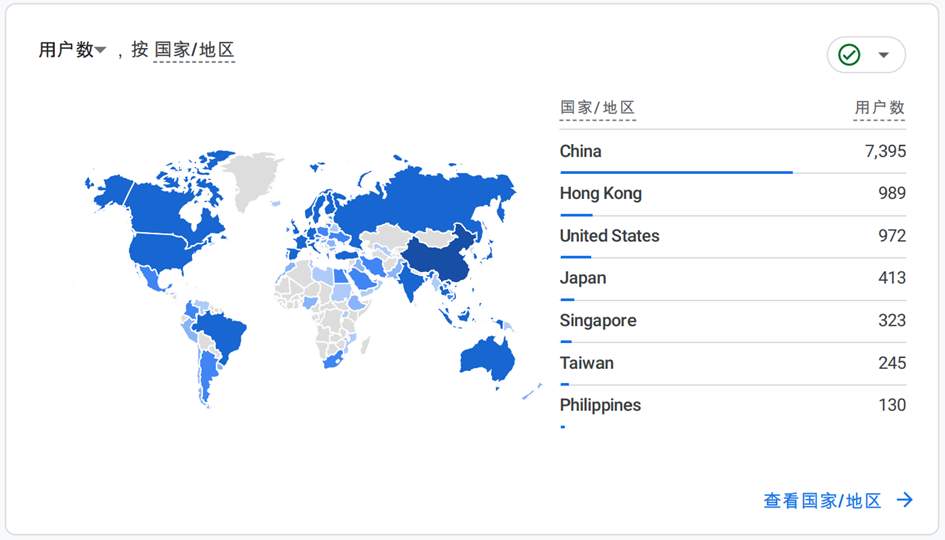

**国际合作**

**1.** 已与 Linux 基金会 CHAOSS 社区达成战略合作，将在 2024 年共同启动开源社区评估 ISO 国际标准制定工作。

**2.** 与 CHAOSS 建立合作伙伴关系，CHAOSS 的开源评估模型通过 OSS Compass 的 SaaS 服务“Compass 实验室”进行验证。

**3.** CHAOSS 将在 2024 年完成部署 OSS Compass 开源生态评估解决方案 SaaS 服务。

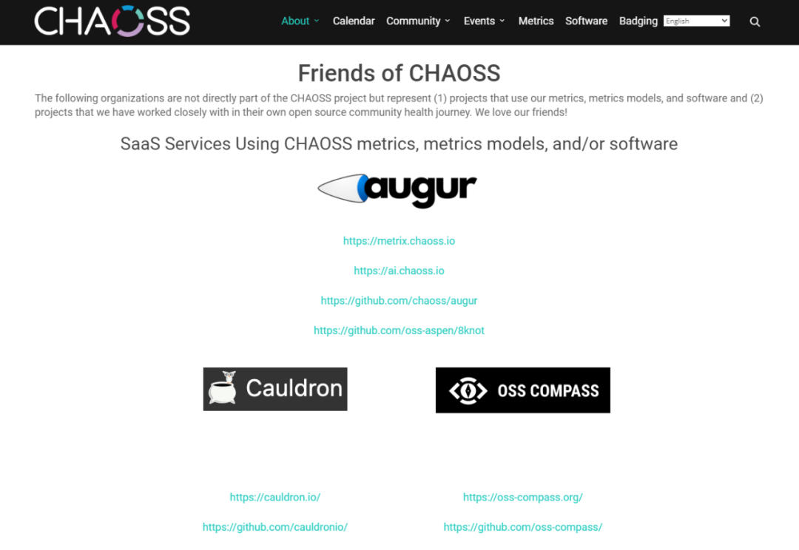

**产业合作**

**1. **11-12 月，国内最大代码托管平台 Gitee 已完成 OSS Compass 开源生态评估解决方案的整合，可进行 3000 万 + 开源项目的 OSS Compass 评估指数展示。

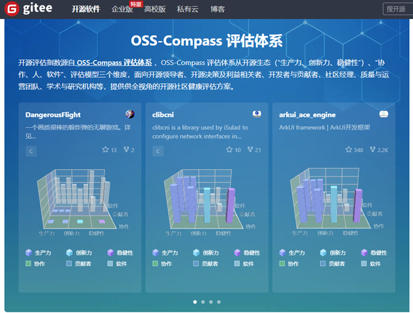

**2. **9-12 月，国内一些科技企业 OSPO 已在自发使用 OSS Compass 的开源生态评估解决方案进行相关开源社区的治理与运营工作。

**3.** 6 月，OSS Compass 为中国开源软件推进联盟（COPU）牵头编撰的《2023 中国开源发展蓝皮书》提供数据支持。

**咨询机构合作**

9 月，OSS Compass 为艾瑞咨询发布的[《2023 中国基础软件开源产业研究白皮书》](https://mp.weixin.qq.com/s?__biz=MzkxMDQzNjc2MQ==&mid=2247485122&idx=3&sn=f6921e9e72b056536a70a0a6d5e8eecc&scene=21#wechat_redirect)提供数据支持。相关文章链接：

- [OSS Compass 助力《2023 年中国基础软件开源产业研究白皮书》发布](https://mp.weixin.qq.com/s?__biz=MzkxMDQzNjc2MQ==&mid=2247484400&idx=2&sn=6b5b1183b20cfac38d80d0355659a1a1&scene=21#wechat_redirect)
- [华为全联接大会 2023 | 开源生态建设，正成为智能世界发展的关键](https://mp.weixin.qq.com/s?__biz=Mzg3OTQzMDcwMA==&mid=2247508742&idx=1&sn=ea51001c54f78987195daea8b50f3b4a&scene=21#wechat_redirect)

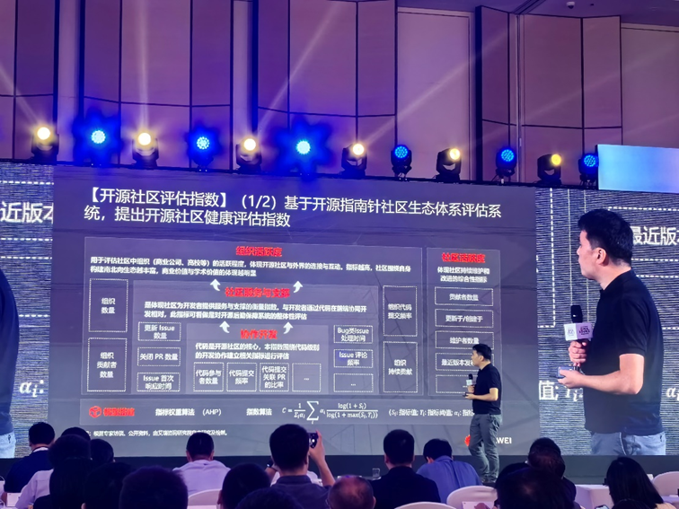

**政府组织合作**

10 月，国家工业信息安全发展研究中心联合南京大学、华为、开源中国、百度等单位在“2023 深圳•中国 1024 程序员节”上隆重启动了[“开源社区发展提质行动”](https://mp.weixin.qq.com/s?__biz=MzkxMDQzNjc2MQ==&mid=2247484711&idx=1&sn=2982ef136090c99fc86ded87ef4ed3cc&scene=21#wechat_redirect)，旨在推动开源社区的健康发展。OSS Compass 为该行动提供数据支持。

**学术合作**

**1. 北京大学、南京大学共 6 个学术成果落地 OSS Compass**

2023 年，OSS Compass 与北京大学、南京大学积极展开学术合作。目前两所高校的 6 个学术成果已经在 OSS Compass 的 SaaS 服务“Compass 协作”中部署。

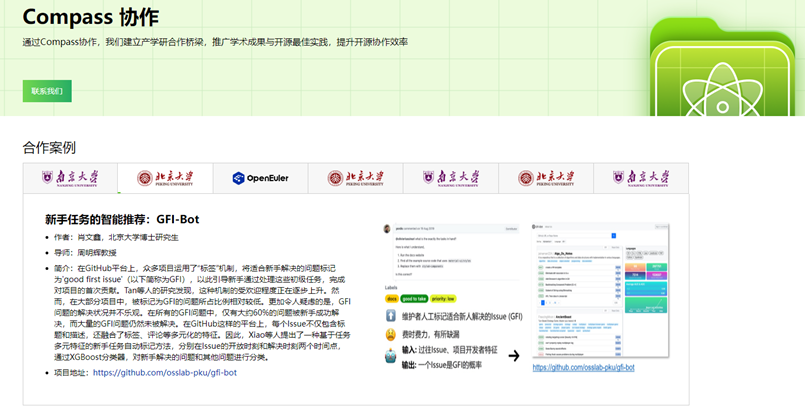

https://oss-compass.org/collaboration

**2. **OSS Compass 助力南京大学发表 CCF-A 会议论文和期刊论文

OSS Compass 支持南京大学汪亮老师团队的[开源 Fork 熵度量](https://mp.weixin.qq.com/s?__biz=MzkxMDQzNjc2MQ==&mid=2247484370&idx=1&sn=59cf5aa13c29112e26f42f27e6ce4e2c&scene=21#wechat_redirect)学术研究，为其在 2023 年 9 月举办的 CCF-A 类会议上发表的论文提供数据支持。

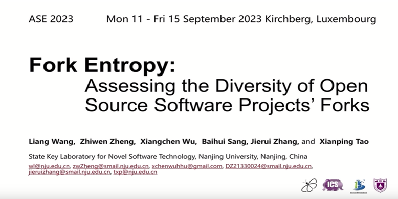

此外，汪亮老师团队还基于以上研究投稿了一篇 CCF-A 期刊论文：Entropy-Based Indices to Quantify Community Evolution in Developer Social Networks，该论文目前在审核中。

**其他合作**

目前，国内政产学研各界开源相关组织以及一些国外高校和开源机构都在积极争取与 OSS Compass 进行合作，具体合作形式正在沟通中，或同时开展项目合作及商业合作。

### Part2。技术进展

**数据集**

截至 12 月，OSS Compass 数据集中已收录 10 万 + 开源项目，主动申请提交到 OSS Compass 的开源项目已有 1000+。项目的技术二级分类已有 300+。

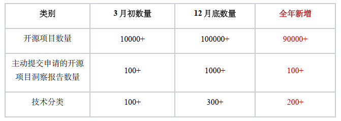

**开源生态评估体系**

**1. 重构开源生态评估体系，新增贡献者模型：**

12 月，OSS Compass 的官网文档页上公布了全新的开源生态评估体系。

这个全新的架构图在“生产力、稳健性、创新力”和“软件、协作、人”交织的三维空间中构建了十几个评估模型。

原先的 SaaS 平台只有 4 个评估模型：“协作开发指数”、“社区服务与支撑”、“社区活跃度”和“组织活跃度”。

现在又新增了 3 个贡献者画像模型，包括“贡献者领域画像”、“贡献者里程画像”、“贡献者角色画像”。

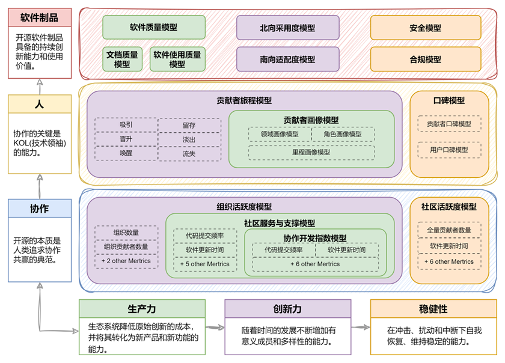

**2. 优化原有评估模型：**

第二、三季度，对原有 30+ 评估指标进行优化，并对“协作开发指数”、“社区服务与支撑”、“活跃度”、“组织活跃度”这 4 个模型的全部指标进行原子化，总共拆分 45 个指标，包括代码、Issue、PR、仓库、贡献者 5 种类型。

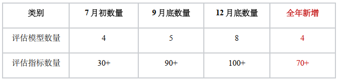

**SaaS 服务**

自从 2023 年 2 月 21 日正式对外发布以来，OSS Compass 一直在技术层面不断加速迭代和优化，以提供更出色的指标模型和 SaaS 服务。截至 2023 年 12 月，在 SaaS 服务方面，我们取得了以下重要的进展：

- **7 月**

  [项目看板 Compass 徽章](https://mp.weixin.qq.com/s?__biz=MzkxMDQzNjc2MQ==&mid=2247484022&idx=1&sn=736190f7ec51e60669ae5e501e7ab54a&scene=21#wechat_redirect)

  [项目看板图表 Y 轴缩放](https://mp.weixin.qq.com/s?__biz=MzkxMDQzNjc2MQ==&mid=2247484045&idx=1&sn=2a9fc3a11f81e4475ccc8e1c78b3f138&scene=21#wechat_redirect)

- **8 月**

  [项目看板图表一分制切换百分制](https://mp.weixin.qq.com/s?__biz=MzkxMDQzNjc2MQ==&mid=2247484084&idx=1&sn=f37e65a8763ee0c6810ba63ecbb8cef3&scene=21#wechat_redirect)

  [Compass 实验室](https://mp.weixin.qq.com/s?__biz=MzkxMDQzNjc2MQ==&mid=2247484283&idx=1&sn=2f7f264022a7905989a48e698a7b197c&scene=21#wechat_redirect)

- **9 月**

  [项目看板一键跳转至仓库](https://mp.weixin.qq.com/s?__biz=MzkxMDQzNjc2MQ==&mid=2247484370&idx=2&sn=a723513a737234e8b0d2887ddb7ef3f2&scene=21#wechat_redirect)

- **10 月**

  [报告页图表可嵌入开源项目网页](https://mp.weixin.qq.com/s?__biz=MzkxMDQzNjc2MQ==&mid=2247484503&idx=1&sn=958ba122fae4365a0eeea43ec35a4597&scene=21#wechat_redirect)

- **12 月**

  [贡献者画像模型](https://mp.weixin.qq.com/s?__biz=MzkxMDQzNjc2MQ==&mid=2247485122&idx=1&sn=f03e0bd59f55774cc75d7bc0026ad3e1&scene=21#wechat_redirect)

  [项目深度洞察功能](https://mp.weixin.qq.com/s?__biz=MzkxMDQzNjc2MQ==&mid=2247485122&idx=1&sn=f03e0bd59f55774cc75d7bc0026ad3e1&scene=21#wechat_redirect)

  [三维评估体系图](https://mp.weixin.qq.com/s?__biz=MzkxMDQzNjc2MQ==&mid=2247485132&idx=1&sn=07eabc35141e0bf69909b4f80d27d3f1&scene=21#wechat_redirect)

  [Compass 协作](https://mp.weixin.qq.com/s?__biz=MzkxMDQzNjc2MQ==&mid=2247485132&idx=1&sn=07eabc35141e0bf69909b4f80d27d3f1&scene=21#wechat_redirect)

### Part3。社区治理

**社区例会**

**1.**12 月 13 日组织[2023 第四季度社区 Board 会议](https://mp.weixin.qq.com/s?__biz=MzkxMDQzNjc2MQ==&mid=2247485055&idx=2&sn=2fe547b2c4a32b455652e566dd56b92f&scene=21#wechat_redirect)，仓库更新 Board 会议纪要 2 次（中英文）；8 月 23 日组织[2023 年度首次社区 Board 会议](https://mp.weixin.qq.com/s?__biz=MzkxMDQzNjc2MQ==&mid=2247484283&idx=3&sn=9967ef4d016e4086bab58c5b7ed5d089&scene=21#wechat_redirect)，仓库更新 Board 会议纪要 2 次（中英文）。

Board 会议纪要：

（中文）https://github.com/oss-compass/community-zh/blob/main/meeting minutes/2023_meeting_minutes/2023_board-meeting-minutes_Zh-CN.md

（英文）https://github.com/oss-compass/community/blob/main/meeting%20minutes/2023_meeting_minutes/2023_board-meeting-minutes_EN.md

**2.** 组织社区技术例会 36 次，仓库更新社区会议纪要中英文共 72 次。

社区会议纪要：

（中文）https://github.com/oss-compass/community-zh/blob/main/meeting minutes/2023_meeting_minutes/2023_community-meeting-minutes_Zh-CN.md

（英文）https://github.com/oss-compass/community/blob/main/meeting%20minutes/2023_meeting_minutes/2023_community-meeting-minutes_EN.md

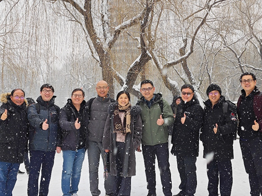

2023 第四季度社区 Board 会议结束后各位 Board 在北大校园合影留念

### 官网维护

全年中，OSS Compass 官网经过多轮更新，包括在官网所有项目头像中添加了 Gitee 或 Github 仓库标识，为仓库添加了技术分类标识，并对官网首页展示内容进行多次优化，以及调整官网菜单栏、新增动态页、优化文档页内容等。

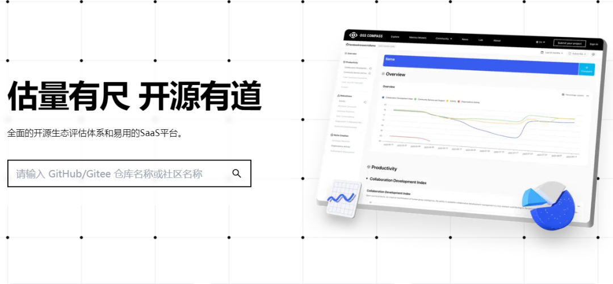
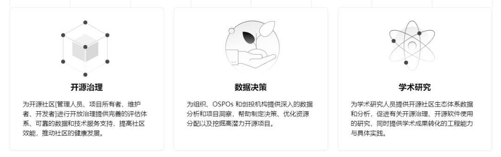
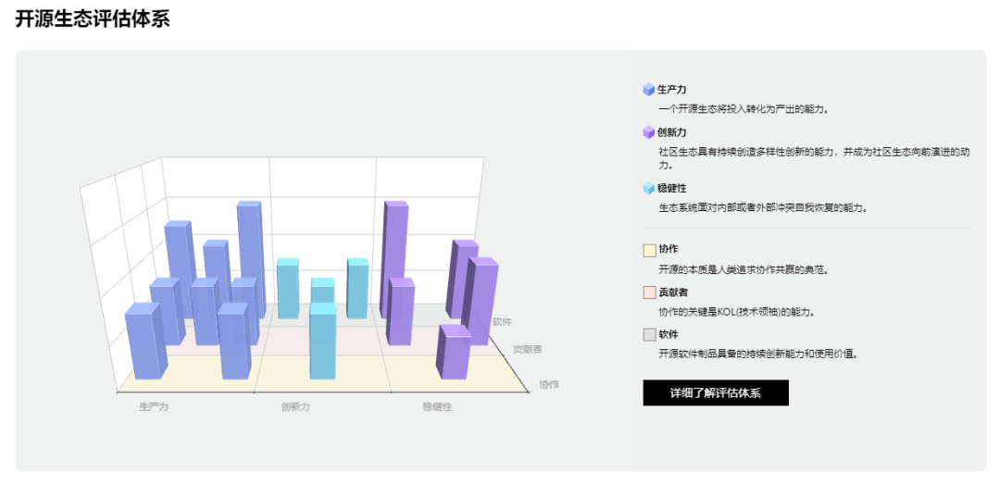

### Part4。社区运营

**社区活动**

12 月 13 日，[OSS Compass 社区 2023 年会](https://mp.weixin.qq.com/s?__biz=MzkxMDQzNjc2MQ==&mid=2247485055&idx=1&sn=fb8992d8ccc843313f9cd820d2972475&scene=21#wechat_redirect)

12 月 1 日，[参加 2023 年 CCF 中国软件大会](https://mp.weixin.qq.com/s?__biz=MzkxMDQzNjc2MQ==&mid=2247484756&idx=1&sn=cfef780c6040cc7126460ddd1803607e&scene=21#wechat_redirect)

11 月 22 日，参加合肥推进开源生态建设交流会（https://gxq.hefei.gov.cn/xwdt/yqyw/18646651.html）

11 月 21 日，[参加 CHAOSScast 访谈节目](https://mp.weixin.qq.com/s?__biz=MzkxMDQzNjc2MQ==&mid=2247484992&idx=1&sn=a0c80511bed3a9aa423fe40d3f81bb43&scene=21#wechat_redirect)

11 月 4 日，[受邀参加 CCF 第七期秀湖会议](https://mp.weixin.qq.com/s?__biz=MzkxMDQzNjc2MQ==&mid=2247484881&idx=1&sn=161b0ea90abd9f810b50eb848a63fa82&scene=21#wechat_redirect)

10 月 24 日，[参加“2023 深圳•中国 1024 程序员节”](https://mp.weixin.qq.com/s?__biz=MzkxMDQzNjc2MQ==&mid=2247484711&idx=1&sn=2982ef136090c99fc86ded87ef4ed3cc&scene=21#wechat_redirect)

9 月 21 日，[参加 OSS EU 2023](https://mp.weixin.qq.com/s?__biz=MzkxMDQzNjc2MQ==&mid=2247484400&idx=1&sn=c3ac26dd4b5a96ca03fab5f52a230d3b&scene=21#wechat_redirect)

8 月 23 日，组织 Compass 实验室发布直播活动，[直播上半部分](https://mp.weixin.qq.com/s?__biz=MzkxMDQzNjc2MQ==&mid=2247484283&idx=2&sn=f6fd46f82bec89a2d391aed54ffbe10e&scene=21#wechat_redirect)、[直播下半部分](https://mp.weixin.qq.com/s?__biz=MzkxMDQzNjc2MQ==&mid=2247484324&idx=1&sn=4e54c0905909dc6b5ec3c14678092edb&scene=21#wechat_redirect)

5 月 28 日，[参加 GOTC 并策划开源生态健康评估论坛](https://mp.weixin.qq.com/s?__biz=MzkxMDQzNjc2MQ==&mid=2247483980&idx=1&sn=0c750bd4d04a2b7cc8398f883227244d&scene=21#wechat_redirect)

4 月 19 日，[参加中国国际软件发展大会开源雨林分论坛](https://mp.weixin.qq.com/s?__biz=MzkxMDQzNjc2MQ==&mid=2247483848&idx=1&sn=0aeb216fe5086a51e82502d404770424&scene=21#wechat_redirect)

2 月 21 日，[开源指南针发布会](http://mp.weixin.qq.com/s?__biz=MzkxMDQzNjc2MQ==&mid=2247483767&idx=1&sn=e7b13b07d126f33bc20fa5ee73130c76&chksm=c12a3181f65db897636e6890dc2333f030ffb3a8506c085967b5a7e66868d9caa88b2b035d97&scene=21#wechat_redirect)

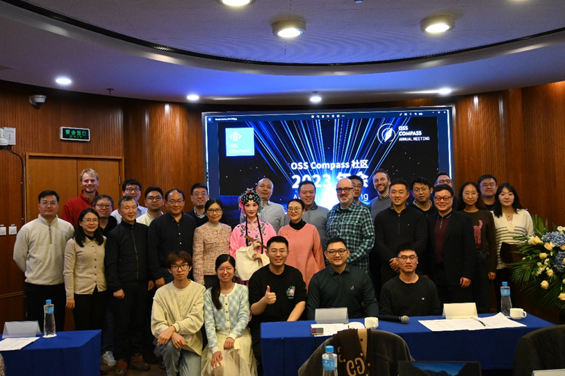

OSS Compass 社区 2023 年会

**营销传播**

**1.** 微信公众号群发 44 篇文章，原创 31 篇，累计关注人数 330+，累计阅读量 10K+。

**2. **Twitter 更新 11 次，累计阅读量 400+。

**3.** 微信视频号更新 17 次，累计播放量近 3000+。

**微信群/Slack 频道**

**1. **官方微信群人数 280+，新增 100+。

**2. **Slack 频道用户 45+，新增 10+ 用户。

### Part5。2024 年社区规划

**技术演进与业务规划**

**1. 继续优化开源生态评估体系及其 SAAS 服务**

（1）完成贡献者旅程、口碑、安全、合规、软件质量等模型的开发工作并上线；

（2）继续集成其他优质开源学术研究成果和社区优秀实践，扩展 Compass 协作的服务；

（3）根据用户诉求，优化目前的开源评估 SaaS 服务。

**2. 展开全球洞察，面向不同群体给与具体开源生态评估解决方案**

（1）为开源社区管理人员、项目所有者、维护者、开发者进行开放治理提供完善的评估体系、可靠的数据和技术服务支持，提高社区效能，推动社区的健康发展。

（2）为组织、OSPOs 和创投机构提供深入的数据分析和项目洞察，帮助制定决策、优化资源分配以及挖掘高潜力开源项目。

（3）为学术研究人员提供开源社区生态体系数据和分析，促进有关开源治理、开源软件使用的研究，同时提供学术成果转化的工程能力与具体实践。

**3. 与创投机构合作，推广 OSS Compass**

通过与创投机构合作，对 OSS Compass 的数据进行解释，进一步整理成案例集，并对 OSS Compass 的用户案例进行推广，吸纳更多用户。

**4. 与 CHAOSS 紧密合作，建立开源生态评估 ISO 国际标准**

与 CHAOSS 共同启动开源社区评估 ISO 国际标准制定工作，预计 2024 年完成初稿。

**5. 建立与 openSSF 的合作**

联合 CHAOSS 共同推动 OSS Compass 成为 openSSF 官方认可的开源评估平台。

### Part6。结语

2023 年，是 OSS Compass 社区诞生并迈向新阶段的一年。在过去的 12 个月里，我们共同见证了社区的快速增长、国际国内的深度合作、技术进展以及社区治理和运营方面的显著成就。

在 2024 年，我们将持续改进和优化，努力为广大开源用户提供更多创新和有价值的功能，积极开展与各方的合作，共同推动全球开源社区生态的健康发展。感谢社区成员的支持与参与，期待在 2024 年我们继续携手同行！
