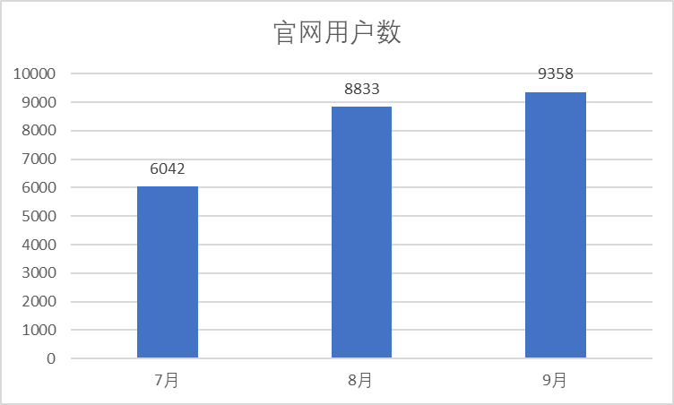
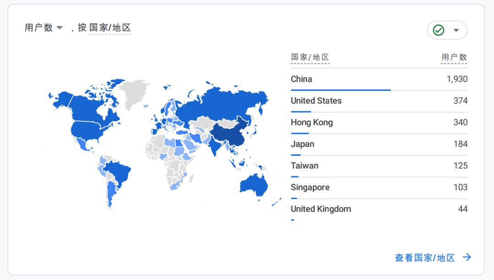
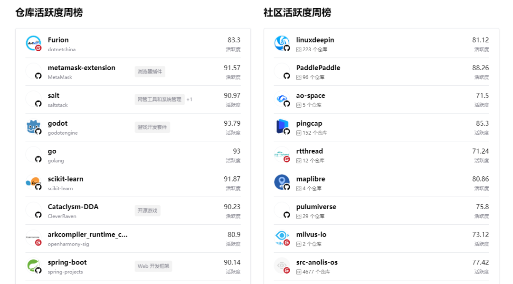
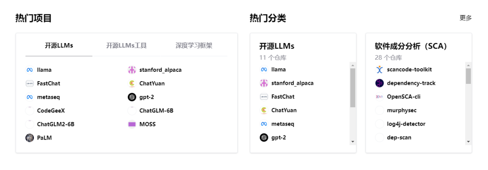
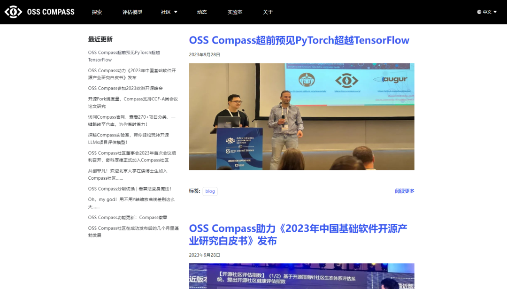
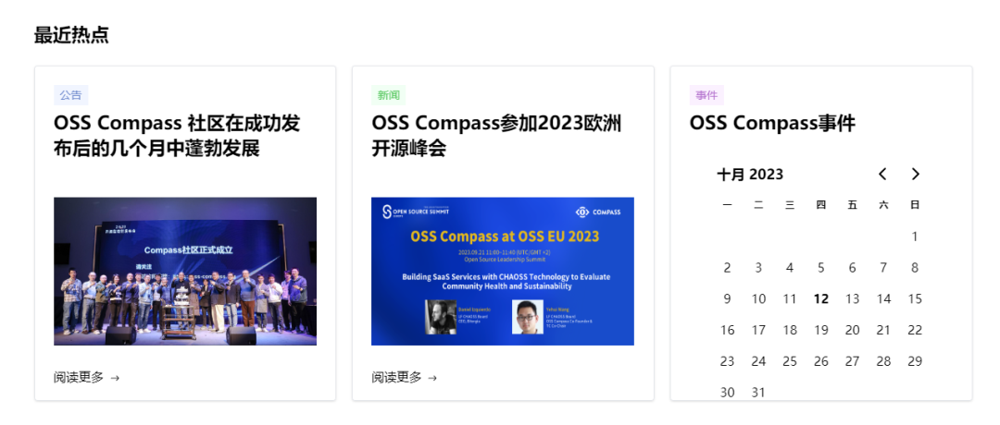

### 社区大事件

- 9 月 21 日参加 OSS EU 2023 并发表演讲，进一步扩大了 OSS Compass 在欧洲乃至全球的影响力，会后收到欧美知名开源项目的合作邀请。

- Compass 成为 CHAOSS 的合作伙伴，CHAOSS 正在推进与 Compass 的深度合作。

- Compass 支持南大学术研究，为 CCF-A 类会议论文提供数据支持。

- Compass 助力《2023 中国基础软件开源产业研究白皮书》发布。

- 8 月 23 日组织 2023 年度首次社区 Board 会议。

- 8 月 23 日组织 Compass 实验室发布直播活动，触达受众上万人。

<!--truncate-->

### Part1。社区价值

#### 用户增长

从 7 月到 9 月，官网总用户数 9300+，新增用户 3300+。

大部分用户来自中国内地，同时来自欧美、日本、新加坡、台湾、香港等国家和地区的用户超过 30%。

#### 战略合作

9 月 21 日，王晔晖代表 Compass 和 CHAOSS 参加 OSS EU 2023 并发表演讲，进一步扩大了 OSS Compass 在欧洲乃至全球的影响力，会后收到欧美知名开源项目的合作邀请。

  

[OSS Compass 超前预见 PyTorch 超越 TensorFlow](https://compass.gitee.com/zh/blog/2023/09/28/foresee-pytorch/foresee-pytorch)

  

与 CHAOSS 达成合作伙伴关系，CHAOSS 正在推动与 Compass 的深度合作。

Compass 支持北京大学、南京大学等高校的学术研究，为南大汪亮老师团队的 CCF-A 类会议论文提供数据支持。

  

[开源 Fork 熵度量，Compass 支持 CCF-A 类会议论文研究](https://compass.gitee.com/zh/blog/2023/09/15/supports-ccf-papers/supports-ccf-papers)

  

Compass 为 9 月 21 日华为全联接大会上发布的《2023 中国基础软件开源产业研究白皮书》提供数据支持，该报告由艾瑞咨询发布。

  

[OSS Compass 助力《2023 年中国基础软件开源产业研究白皮书》发布](https://compass.gitee.com/zh/blog/2023/09/28/release-white-paper/release-white-paper)

  

### Part2。技术进展

自从 2023 年 2 月 21 日正式对外发布以来，OSS Compass 一直在技术层面不断加速迭代和优化，以提供更出色的指标模型和 SaaS 服务。同时也在不断扩充数据集。

#### 数据集

从 7 月份到 9 月份，Compass 评估数据集新增 3 万+项目，收录的开源项目数量由 2 万+增加至 5 万，为用户提供更广泛的选择。同时优化了项目的技术分类，新增 200+二级分类，总分类数量由 100+增加至 300+。

| 类别         | 7 月初数量 | 9 月初数量 | 新增   |
| ------------ | ---------- | ---------- | ------ |
| 开源项目数量 | 20000+     | 50000+     | 30000+ |
| 技术分类     | 100+       | 300+       | 200+   |

#### 开源生态评估体系

对原有 30+评估指标和 4 个评估模型进行优化，完善活跃度模型的“更新于”指标，在评估指标中排除已存档仓库。原子化“协作开发指数”、“社区服务与支撑”、“活跃度”、“组织活跃度”这 4 个模型的全部指标，包括代码、Issue、PR、仓库、贡献者 5 种类型，总共拆分 45 个指标。

#### SaaS 服务

从 7 月到 9 月，Compass 新增 SaaS 服务——Compass 实验室，同时新增项目看板的 Compass 徽章、图表 Y 轴缩放、图表一分制切换百分制、一键跳转至仓库等功能。

[探秘 Compass 实验室，带你轻松玩转开源 LLMs 项目评估模型！](https://compass.gitee.com/zh/blog/2023/09/01/explore-compass-lab/explore-compass-lab)

[OSS Compass 功能更新：Compass 徽章](https://compass.gitee.com/zh/blog/2023/07/22/compass-badge/compass-badge)

[Oh，my god！用不用 Y 轴缩放曲线差别这么大……](https://compass.gitee.com/zh/blog/2023/07/28/y-axis-scaling/y-axis-scaling)

[OSS Compass 分制切换 | 看算法变身魔法！](https://compass.gitee.com/zh/blog/2023/08/05/scoring-system-switch/scoring-system-switch)

[访问 Compass 官网，查看 270+项目分类，一键跳转至仓库，为你省时省力！](https://compass.gitee.com/zh/blog/2023/09/15/visit-project-categories/visit-project-categories)

### Part3。社区治理

#### 社区例会

7-9 月，组织技术例会 19 次，仓库更新会议纪要中英文各 17 次。

https://github.com/oss-compass/community-zh/blob/main/meeting minutes/meeting-minutes_Zh-CN.md

8 月 23 日组织 2023 年度首次社区 Board 会议，仓库更新 Board 会议纪要 1 次。

https://github.com/oss-compass/community-zh/blob/main/meeting minutes/board-meeting-minutes.md

  

[OSS Compass 社区董事会 2023 年首次会议顺利召开，奇科厚德正式加入 Compass 社区](https://compass.gitee.com/zh/blog/2023/09/01/first-board-meeting/first-board-meeting)

  

#### 官网维护

在官网所有项目头像中添加了 Gitee 或 Github 仓库标识，并为仓库添加了技术分类标识，以提供更清晰的信息。

官网首页优化了热门领域的内容，将其改为热门项目与热门分类两个部分，其中热门项目展示了近来非常热门的开源 LLM、深度学习框架相关的项目，热门分类则随机显示不同技术分类下的项目。

官网增加了动态一栏，更新了社区的技术更新与活动新闻等内容，并在首页展示了最近动态。

### Part4。社区运营

#### 社区活动

8 月 23 日组织 Compass 实验室发布直播活动一次，6 个平台同时转播，触达受众上万人。

直播上半部分：[OSS Compass 社区探讨“开源大模型是不是真开源”话题，万众瞩目！](http://mp.weixin.qq.com/s?__biz=MzkxMDQzNjc2MQ==&mid=2247484283&idx=2&sn=f6fd46f82bec89a2d391aed54ffbe10e&chksm=c12a338df65dba9b750193dd74bf72aaf501883be3679b7fc3aa4f1dfba4b45345f823f1ee5b&scene=21#wechat_redirect)

直播下半部分：[开源的未来：Compass Lab 引领 LLMs 时代的新征程](http://mp.weixin.qq.com/s?__biz=MzkxMDQzNjc2MQ==&mid=2247484324&idx=1&sn=4e54c0905909dc6b5ec3c14678092edb&chksm=c12a3352f65dba4418f3794c31b11de0b61693df39e7a53f3d8b6381a278455a69d0a2d2255b&scene=21#wechat_redirect)

9 月 21 日，王晔晖代表 Compass 和 CHAOSS，在 OSS EU 2023 发表演讲。

  

[OSS Compass 超前预见 PyTorch 超越 TensorFlow](http://mp.weixin.qq.com/s?__biz=MzkxMDQzNjc2MQ==&mid=2247484400&idx=1&sn=c3ac26dd4b5a96ca03fab5f52a230d3b&chksm=c12a3306f65dba10586c4eb8a093c333bf038191781001fe5891598f93536abf1cced876cf87&scene=21#wechat_redirect)

  

#### 营销传播

微信公众号 7 至 9 月群发 15 篇文章，
其中 5 篇功能更新，
6 篇活动预告及回顾，
1 篇社区成员介绍，2 篇社区合作新闻，1 篇社区董事会会议新闻。累计关注人数 230 多人，累计阅读量近 3000 人次。

Twitter 更新 10 次，
累计阅读量近 300 次。
微信视频号更新 3 个视频，
包括 8 月 23 号直播活动的 2 个视频
以及 9 月 21 号 OSS EU 2023 演讲，
累计播放量近 700 次。
官方微信群新增 90 多人。

### Part 5: 结语

OSS Compass 一直致力于不断改进和扩展，
以满足用户不断变化的需求，
提供更全面、灵活和高效的
开源项目评估服务。
我们将继续努力，
为广大开源用户提供
更多开源评估度量领域创新和
有价值的功能。
