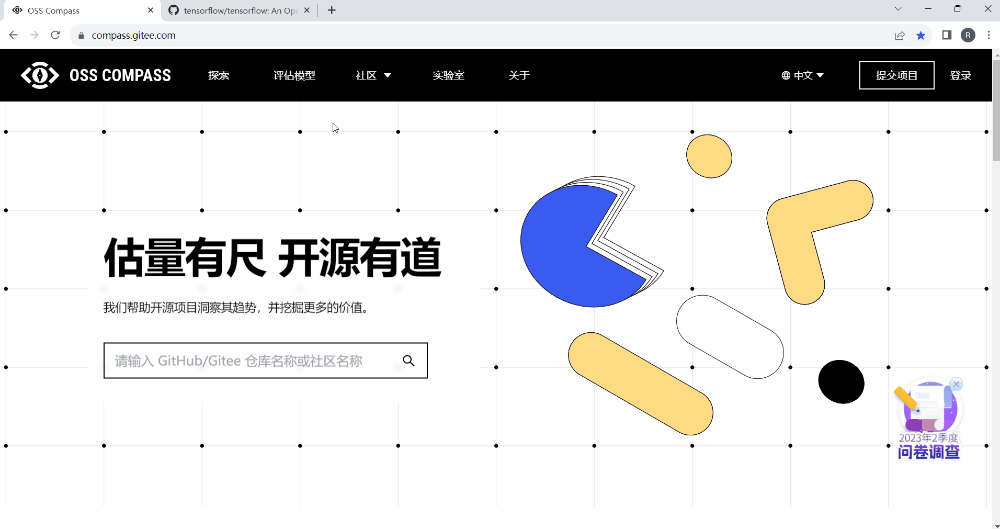

<!--truncate-->

### 01 Compass 徽章简介

OSS Compass 近期新增“Compass 徽章”功能，开源项目添加 Compass 徽章后，可实时查看开源项目生产力、稳健性和创新力三个评估指标的最新值，并能一键跳转至 Dashboard 了解项目具体状态。

### 02 如何添加 Compass 徽章

1. 在 OSS Compass 官网的”探索“页面找到开源项目并点开，可跳转至该项目的 Dashboard 页面；

2. 在 Dashboard 页面右上角点开设置小图标，找到”Compass 徽章“功能并打开，可以看到 Compass 徽章页面；

3. 在 Compass 徽章页面，选择想要添加的徽章（项目总体状态徽章或单个指标徽章），复制徽章的 URL；

4. 将复制的 URL 添加至该项目 Github 仓库的 Readme 文档中，保存后即可查看徽章。

以下是添加 Compass 徽章的操作演示：

  

划重点：
开源项目使用 OSS Compass 模型进行评估分析后，才能添加 Compass 徽章哦！

  

前面提到添加徽章后会跳转到 Dashboard 页面，可了解开源项目的状态。实际上，在 Dashboard 中，不仅可以了解开源项目最新状态、变化趋势，还可以与其他项目的数据进行对比分析。预知详情，且听下回分解吧。

OSS Compass 发布仅仅 5 个月，我们已收获大量好评，有国外用户评价 OSS Compass 是“a brilliant project（一个出色的项目）”。

未来，OSS Compass 将持续演进，回馈广大用户，为开源项目评估提供更大便利，助力开源社区健康可持续发展。

我们期待更多开发者加入 OSS Compass 社区，一起为 OSS Compass 的发展贡献力量。同时，也欢迎广大用户持续使用和反馈，为我们提升 OSS Compass 的能力提供源源不断的动力。
