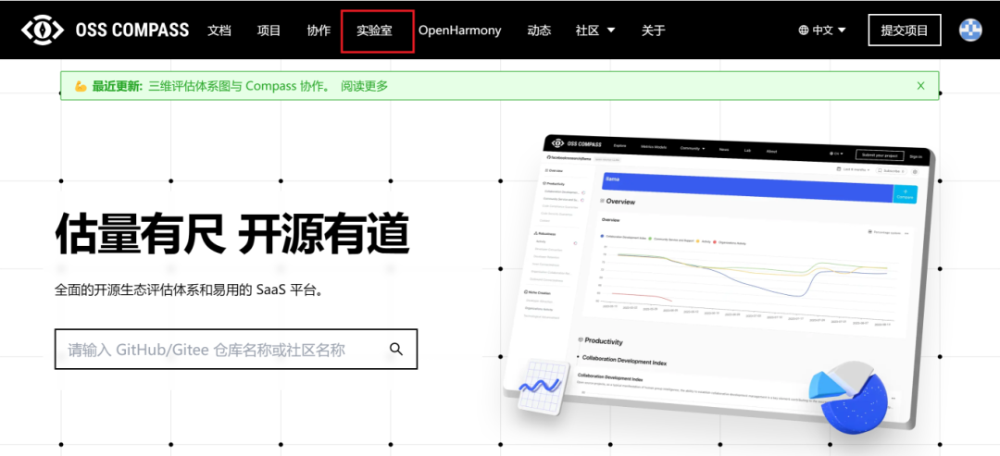
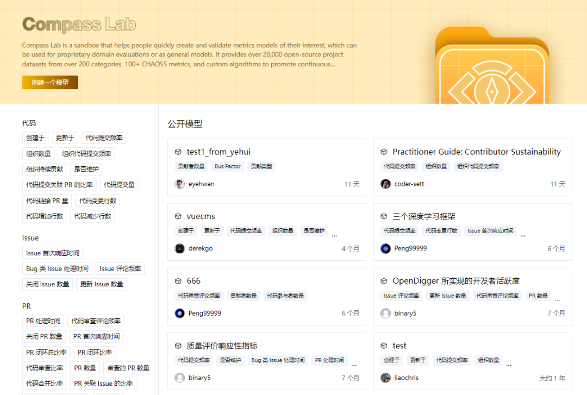
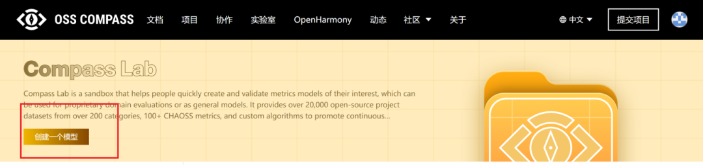
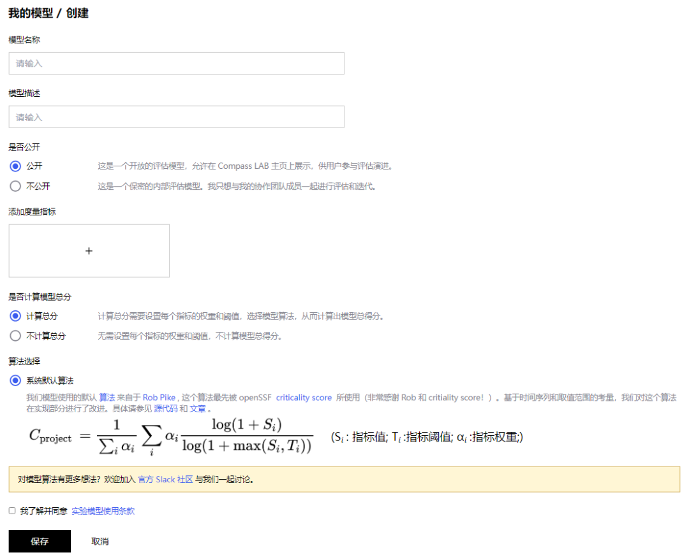
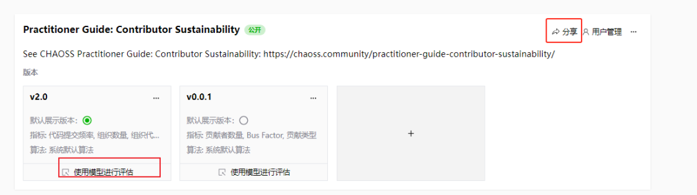
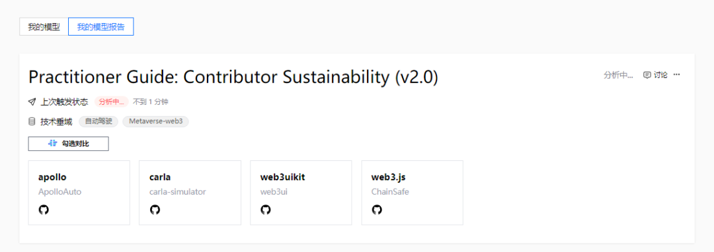
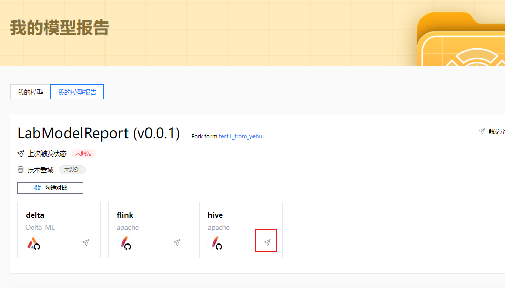

哈喽，各位开源小伙伴们，大家还记得去年 Compass 推出的 SaaS 服务 ——Compass 实验室（Compass Lab）吗？（可查看往期文章：探秘 Compass 实验室，带你轻松玩转开源 LLMs 项目评估模型！）相信好多用户都已经体验过这个超棒的功能啦！它可是用户管理评估项目的得力助手，不仅汇聚了海量数据，还能提供全方位的健康评测服务，这一年来也收获了不少用户的好评。

<!--truncate-->

现在，我们对 Compass 实验室功能进行了升级更新啦！不仅功能更多样化，用户操作也变得更加方便快捷，快来和我们一起看看都有哪些新变化吧~

### **探索 Compass Lab 新变化**

首先进入 OSS-Compass 官网，点击进入“实验室”，开始和我们一起体验更新后的 Compass 实验室有多好玩~

**1.进入首页：改版更明晰**

进入 Compass 实验室首页，可以发现我们的模型列表改版了，直接点击模型便可进入该模型详情页；另外新增指标分类筛选条件“组织代码提交频率、组织持续贡献”等，帮助大家更快捷、更准确地找到自己的模型。

**2.创建模型：操作更快捷**

点击创建模型，你会发现已经不需要选择数据集啦！只需要输入模型名称和模型描述，选择度量指标并调整权重和阈值就 OK~

**3.生成评估报告：定制更精准**

模型创建后，可在“我的模型页”使用该模型指定版本进行评估，即选择数据集并生成模型报告。不同模型版本可以生成不同的模型评估报告，用户可以根据自己的喜好定制报告。

另外我们还对公开模型新增分享按钮，其他用户可通过链接访问该模型并查看公开的模型报告，也可以对公开的模型版本直接使用模型进行评估，是不是超级方便又实用呢？

**4.查看报告：等待时间更短**

在“我的模型报告”部分或模型详情页查看生成的模型报告，点击触发分析并等待完成，就可以查看评估报告啦。

新增模型报告触发单个项目分析，很贴心地为大家减少了等待时间~

**5.更多功能：持续更新中**

另外，Compass 实验室还会联合 CHAOSS 新增更多模型和指标，关于我们是如何联动，又会碰撞出怎样的火花呢？大家可以持续关注“开源指南针”公众号，第一时间了解新动向~

看到这里，是不是已经对 Compass 实验室目前更新的功能已经了解得差不多啦，那就快来试一下吧~

未来，OSS-Compass 将不断演进，为广大用户提供更多便利的评估服务，不断提高社区效能，推动社区健康发展。
