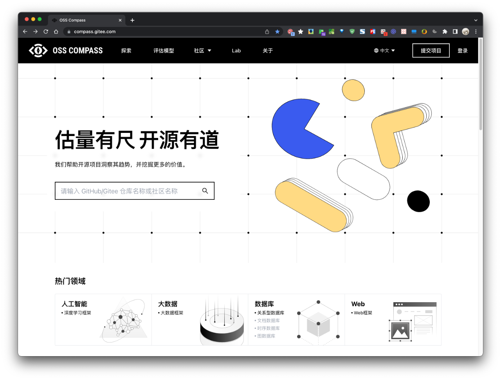
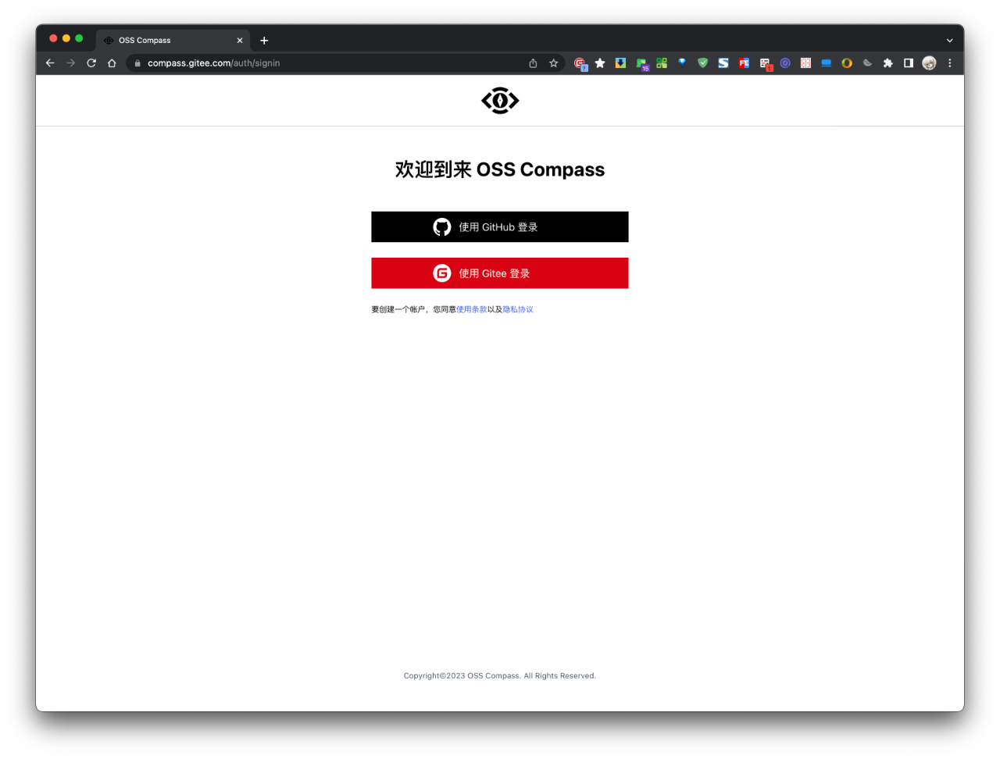
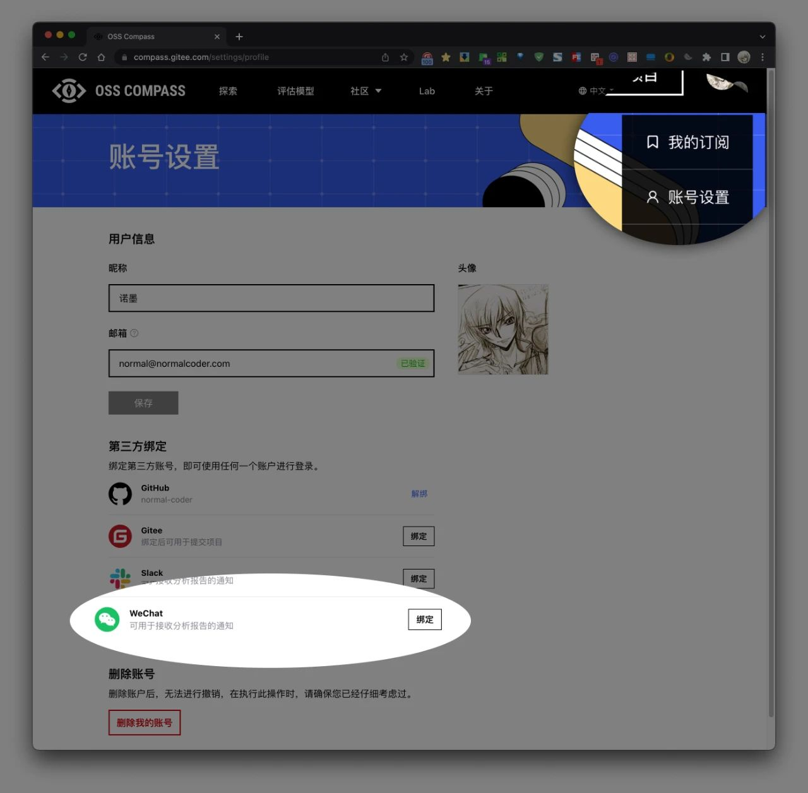
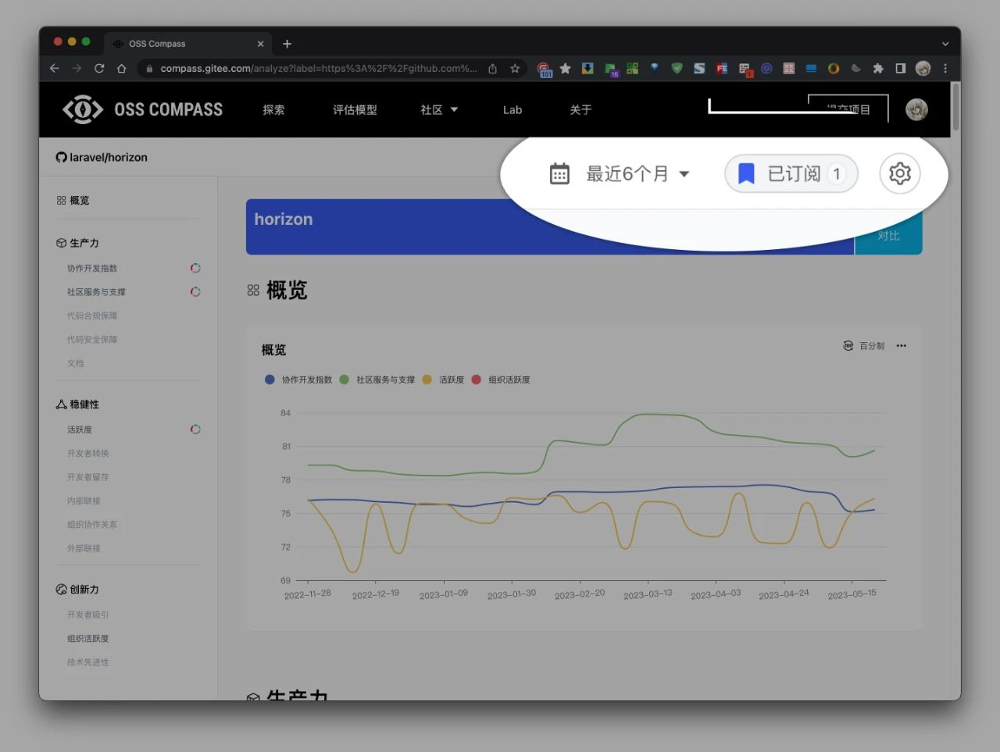
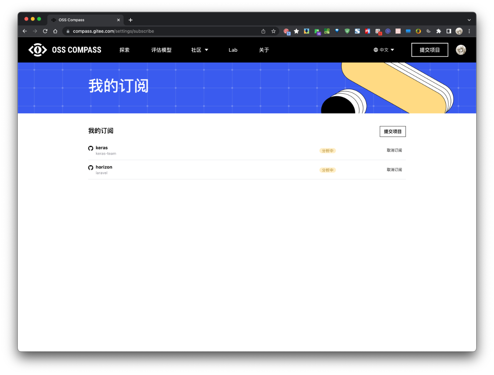

经过了一个小阶段的开发，OSS Compass 支持帐号登录跟分析报告订阅了。如果你对某个开源软件或社区的发展趋势或变化感兴趣。你可以对其报告进行订阅。支持 邮件 / 微信公众号 / Slack 订阅。

<!--truncate-->

具体操作如下：

1. 访问 Compass 网站（compass.gitee.com），使用 GitHub/Gitee 帐号进行登录。
2. 如果你希望通过微信或 Slack 进行订阅，登录后可以再「帐号设置」下进行绑定。当然，你也可以选择使用邮箱来订阅。
3. 找到你关注的开源项目或社区洞察分析报告，点击右上角「订阅」按钮。

如果有任何问题，欢迎通过 https://compass.gitee.com/docs/zh/community/ 与我们联系交流，共同探讨开源生态评估和洞察。

