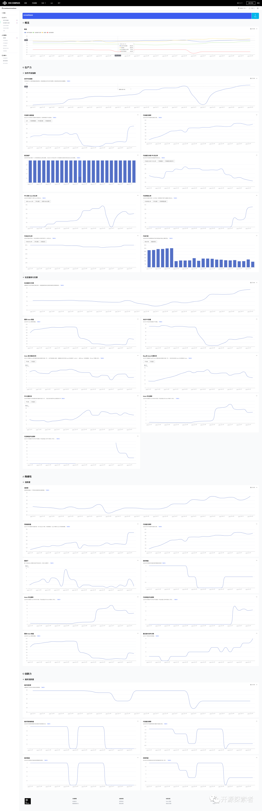
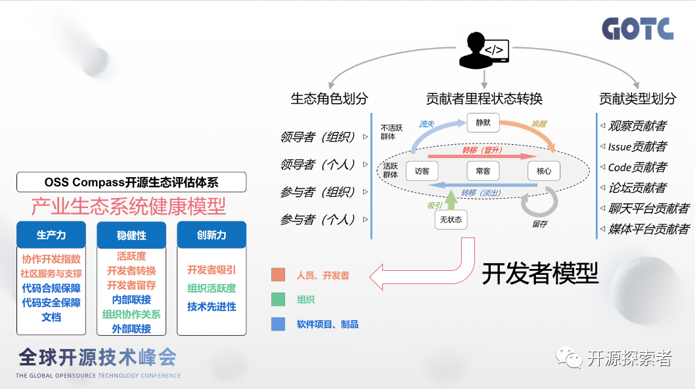
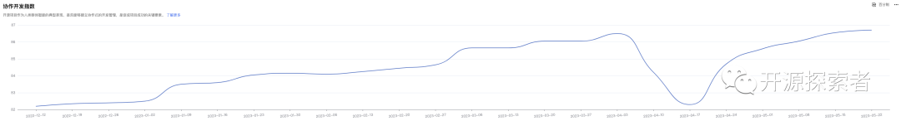
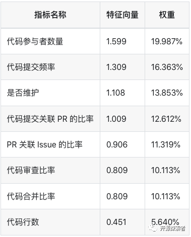
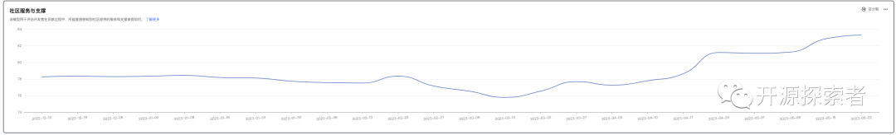
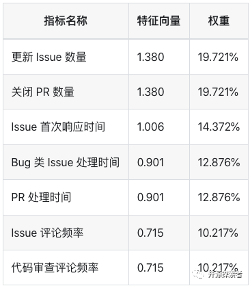
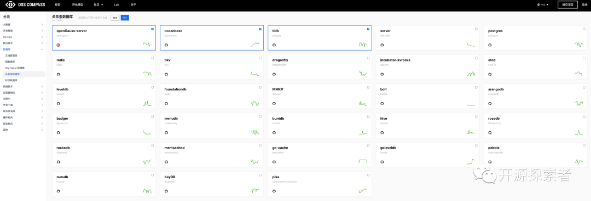
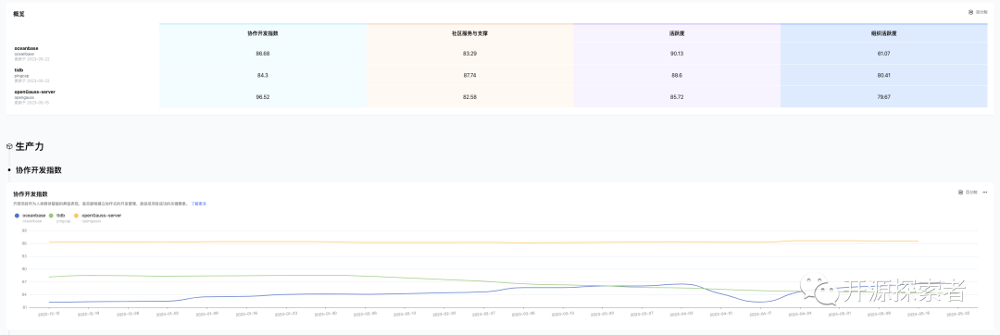
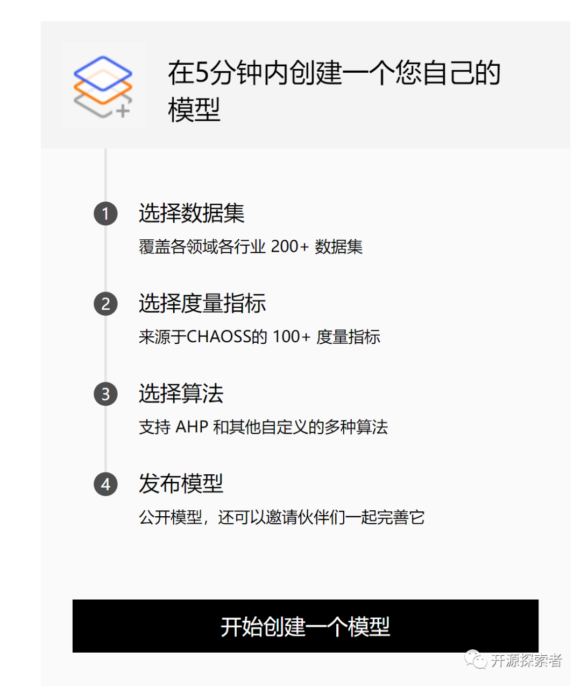

以下文章来源于开源探索者 ，作者 subranium

笔者在 GOTC-2023 上参加了开源指南针[1]的专场，本文就来介绍一下开源指南针是什么以及如何使用它来进行开源项目分析。

<!--truncate-->

### 关于开源指南针

开源指南针在我看来像是一个开源生态体系的展示大屏，当你想要了解一个开源项目的时候，可以直接输入该项目名称进入展示界面，当输入 OceanBase[2] 时效果如下图（长图警告）：

开源指南针也与 CHAOSS[3] 是深度合作的关系，开源指南针社区的愿景和使命如下（来自王晔晖老师在 GOTC 上的分享）：

> 通过构建可持续演进的开源生态评估体系和通用平台，为围绕开源生态可持续发展制定的各种决策，提供深入、持续和可靠的数据洞察，形成共识。

在开源指南针首页还有一张图，展示了开源指南针对于开源生态评估体系的理解，分别从稳健性、生产力、创新力三个维度对开源生态进行衡量。

汪亮老师在 GOTC 上分享了关于开发者模型的思考，如下图

在这里将开发者分成了五种状态：

无状态：从未在社区贡献过的人

- 访客：偶尔在社区做贡献的人
- 常客：频繁在社区做贡献的人
- 核心：季度年度产生了 80%贡献的那一群人
- 静默：曾有贡献现在离开的人

并希望根据开发者的不同状态，设计对应的方法激活开发者状态转移与开源项目活跃度的衡量。

### 如何使用开源指南针进行开源项目分析

在开源指南针的展示界面里有几个指标值得参考，我们还是拿 OceanBase 为例。

#### 协作开发指数

在协作开发指数[4]这一栏下可以看到这个走势图

该指标是根据多个子指标加权计算得来

比如里面的代码提交关联 PR 的比率，就是看一个开源项目的代码提交是不是通过开放协作的方式来生产代码的，还是只是公司内部的流程直接 commit 到分支上，社区的伙伴根本无法知道该 commit 的上下文。

那如果我都是通过提交 PR 的方式贡献代码，但是提交完 PR 之后我直接合并到分支中，这个同样也是会让社区产生疑问的行为，关于这个也有对应的代码合并比率指标进行权重衡量。

#### 社区服务和支撑

关于这个指标简单来理解就是你在一个开源项目做了一些动作，无论是提交 Issue 还是提交 PR，社区有没有人理你，多长时间理你。当你提交了一个 Issue 很快就有对应的同学来进行回复讨论，这样会激发你的兴趣，促使更多的贡献。

同样该指标也是由多个指标加权平均求得

其中 Issue 的首次响应时间在统计时也去除了机器人的干扰。

关于 活跃度和组织活跃度目前还并不完善，感兴趣的小伙伴可以持续关注。

#### 项目对比

除了分析一个项目，我们也可以选择几个项目进行对比，比如选择 OpenGauss-server[5]、OceanBase 和 TiDB 进行对比。

这样就会在界面中将选中的项目进行横向对比，方便查看不同项目当前的状态

如果你想深入研究的话就可以对应着去拉一下项目在时间段内具体都做了哪些 Issue 和 PR 等其他动作，帮助你来理解项目发生了什么。以及为什么有些指标这个某个项目做的很好，是否对构建社区有价值。

感兴趣的朋友还可以体验一下 Compass Lab[6]（目前还未对外开放），可以让你创建一个特定的数据集与评估模型帮助你获取更多想要观测的数据。

### 总结

开源指南针类似于第一篇文章《如何进行开源项目分析-OSS Insight》里面提到的 PingCAP 开发的 OSS Insight[7]，但是开源指南针中并不是将数据简单的罗列，还多了一些指标的衡量，可以帮助你更快速的认识一个开源项目。

### 参考文献

[1] https://compass.gitee.com/
[2] https://github.com/oceanbase/oceanbase
[3] https://chaoss.community/
[4] https://compass.gitee.com/docs/zh/metrics-models/productivity/collaboration-development-index/
[5] https://gitee.com/opengauss
[6] https://compass.gitee.com/lab
[7] https://ossinsight.io/
