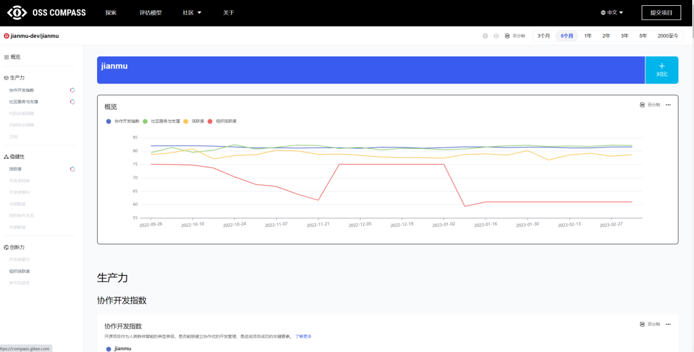

近日，面向 DevOps 领域的开源无代码/低代码工具建木官网迎来了一项重要的更新——与开源生态健康评估平台 OSS Compass 的集成。通过增加“生态评估”跳转链接，用户现在可以直接访问 OSS Compass 上的建木产品主页，全面了解项目健康状况。这一举措无疑将极大地提升建木在开源社区的活跃度，为其在 DevOps 领域的发展壮大注入新的活力。

<!--truncate-->

建木是一款专为 DevOps 领域设计的极易扩展的开源无代码(图形化)/低代码(GitOps)工具，旨在帮助用户轻松编排各种 DevOps 流程并分发到不同平台执行。建木三大特点：1）图形化编排，节点自由拖拽，参数快速配置，高效构建项目；2）配置即代码，提供声明式语法将流程代码化，通过代码库进行版本控制，快速实现幂等部署与故障恢复；3）流程可视化，流程配置可视化，任务编排与执行状态一目了然。

OSS Compass 作为一款开源生态健康评估平台，致力于分析开源社区健康状况。该平台由国家工业信息安全发展研究中心、开源中国、南京大学、华为、北京大学、新一代人工智能开源开放平台（OpenI）、百度、腾讯开源联合发起，面向 GitHub、Gitee 等平台所有开源项目开放。

OSS Compass 构建了一个包括生产力、稳健性、创新力三个维度，涵盖 14 个指标模型在内的开源生态评估体系。通过 OSS Compass 网站，只需输入 GitHub.com 或 Gitee.com 的仓库或社区名称，即可全面了解开源项目的健康状态，使用简单，高效便捷。

通过建木与 OSS Compass 的强强联手，建木将更加透明地展示项目的健康状况，从而吸引更多的开发者和企业关注、参与其中。这一合作不仅有助于建木在开源社区中的活跃度，还将进一步提升其在 DevOps 领域的影响力。

我们相信通过双方的共同努力，建木将为 DevOps 领域带来更多的创新与价值，推动整个行业的技术进步。我们诚邀广大开发者和企业一起加入建木的开源社区，共同推动建木的发展，共创 DevOps 领域的开源生态繁荣！让我们携手共建一个更加活跃、健康、繁荣的开源社区，为 DevOps 领域的技术创新提供强大的支持。
