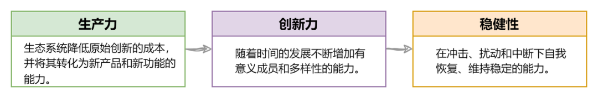
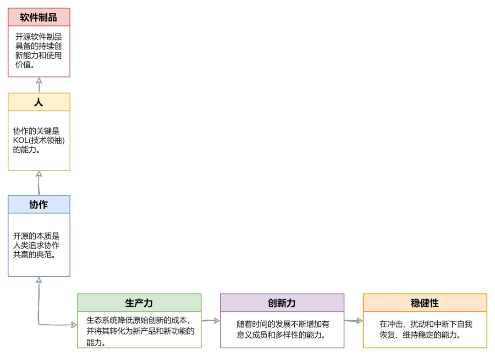
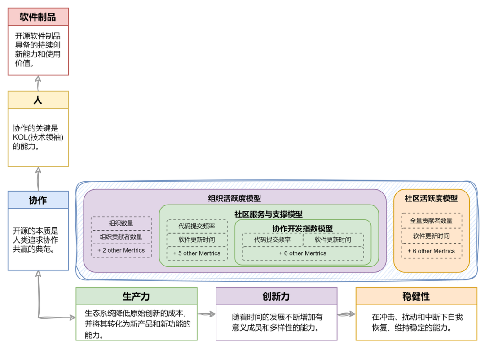
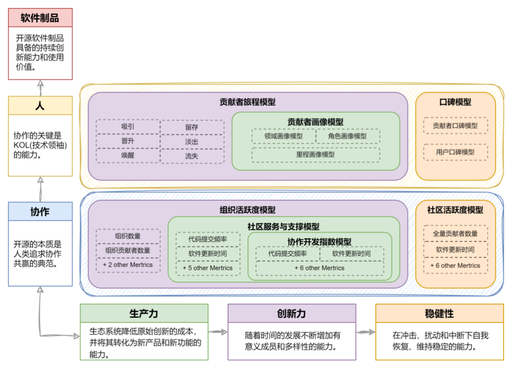

近年来，我一直从事与开源生态评估相关的工作。本系列文章旨在总结我的工作经验，并整理出接下来的工作思路，同时期待与大家的交流。

在我之前的文章《开源生态评估与度量的思考（一）——演进与趋势》中，我总结了开源社区评估与度量的三个主流方向：开源软件、开源项目和开源生态。然而，对于技术洞察工作而言，这只是迈出万里长征的第一步。

作为一名工程师，我更希望看到一个实际可行的评估体系的出现，它应具备以下几个特点：能够帮助开源社区发现具体问题，帮助人们发现有价值的开源社区，以及预测产业趋势等。

总之，这个评估体系应该是实践导向的，能够提供实际价值，而不仅仅是一种虚无缥缈的理念。

<!--truncate-->

### 01 对开源本质的思考

然而，在构建评估体系的过程中，我们必须首先回答一个根本性的问题：“开源的本质是什么？”这个问题的答案至关重要。

我的回答是，开源的本质是协作，进一步说，开源的本质是人类协作的天然社会属性在软件开发过程中的典型范例。

在探索这个问题的答案时，我受到了复杂经济学两位奠基人布莱恩·阿瑟和埃里克·拜因霍克的两本书《技术的本质》（The Nature of Technology: What It Is and How It Evolves）和《财富的起源》（The Origin of Wealth: The Radical Remaking of Economics and What it Means for Business and Society）的启发。尽管复杂经济学仍存在一些未解之谜，但他们提出的一些观点已得到广泛认可。例如：

“人类是‘有条件的合作者’，只要对方慷慨，自己也会慷慨，同时人类也是‘利他的惩罚者’，人们会回击那些做出不公正行为的人，甚至不惜以自己的当前利益作为代价。”

开源软件通过提供有条件的（许可证）源代码给予人们使用自由。通过开放透明的开发过程，进一步激发人们天然的协作属性，共同参与贡献，从而促进开源生态的繁荣。

然而 Fork 和许可证的存在则如同达摩克利斯之剑，时刻提醒人们激发“利他的惩罚者”特性，导致社区分裂以及合作和商业道路的分岔。

因此，在构建整个开源评估体系的过程中，我将“开源的本质是协作”作为指导思想。这一原则可以确保我不会在众多指标和数据中迷失方向，并有助于实现评估体系设计的准确性和有效性。

在上世纪 90 年代，人们开始关注以开源形式进行软件开发和分发的开源软件质量。这个方向始终是业界的关注焦点，因为软件作为实际面向用户的产品，是开源价值的具体体现。在这个方向上，评估指标和维度的构建大多可见 CMMI（Capability Maturity Model Integration）的影子，因此我们看到了许多以"开源"和"成熟度"为关键词的评估框架，例如 OpenSource Maturity Model，用于根据不同成熟度层次评估软件。

### 02 评估体系的多维空间

开源评估体系构建是一个复杂任务。使用单一指标或维度难以全面衡量开源的本质。然而，人们倾向于用简单的标志来概括对象，这就是为什么"star"出现的原因。

过于依赖直观感性信息会掩盖理性思考，导致开源世界的浮躁情绪难以解决。但是，我们不应该谴责"star"，而是应该正视和承认它的价值，并提出自己的见解。我构建了一个评估体系的三维空间，包括开源生态、“协作、人、软件”和评估模型。

#### 第一维：开源生态

首先，开源评估的三个主流方向之一“开源生态”作为第一个维度，它衍生于商业生态，并且商业与开源的协同是当前的主流趋势。

在开源生态中，我们通过生产力（Productivity）来评估开源项目输出软件制品和开源价值的能力。

开源项目需要作为一个平台或生态系统吸引多样化成员的加入，这些成员可以来自上游驱动软件或下游应用软件，我们将这种能力称为创新力（Niche Creatation）。

同时，作为一个生态系统，它必须具备稳健性（Robustness），即抵御内外干扰并自我恢复的能力。

  

图一

  

#### 第二维：“协作、人、软件”

第二个维度包含三个核心要素：协作、人、软件。这与开源本质的思考吻合。

首先，我们探究了开源协作的度量维度，它代表了开源开发行为中协作的程度和深度。

其次是人，这里的人我们具象到开源项目中的 KOL（技术领袖），当然它还有许多其他代名词，如核心开发者、关键开发者、Maintainer 等等，我们用这个维度观察 KOL 在开源项目中的影响力，并通过第三方视角考察用户和开发者对开源项目的评价。它参考了开源评估主流方向之一“开源项目”的思想，但把落脚点放在了人这个关键词上。

最后，我们着眼于软件，一个开源项目对外输出的最终价值是以软件制品的形式存在，也是我们考究一个项目的价值最终落脚点。它是开源评估最“古老”的主流方向之一“开源软件” 的具体表现。

下图展示了截止到现在，所介绍的两个维度的评估体系的关系。

  

图二

  

#### 第三维：评估模型

评估模型作为第三个维度，位于两个维度的交叉点上。每个评估模型都具备开源生态和“协作、人、软件”两个维度的属性，并且评估模型之间存在逻辑关系，可以单独构成一维。评估模型的概念是基于此设定的。

#### 1. 评估模型的概念

评估模型的概念是我们首先要介绍的。

a 模型的构成标准

评估模型是为了实现具体评估目标而设计的。在数据分析领域，我们都熟知一条原则：“无目标，则度量无意义”，同样适用于开源评估。举例来说，如果我的目标是找到开源项目的核心开发者，首先我会根据目标定义核心开发者的特征，然后建立开发者画像模型和 Proxy 指标，并最终使用相关数据对其进行评估，以找到核心开发者。每个评估模型都由多个度量指标构成，这些指标是评估体系的最小原子单位。

为了实现特定的评估目标，我们需要找到与该目标直接或间接相关的一组可量化指标，即特征。这些指标应满足以下几个条件：

- 可量化：能够被度量。
- 具有时间属性，可以进行趋势观测。
- 避免直接用计数指标，更多地考虑比率。
- 具有弱相关性，避免重复信息。
- 尽可能具备全面视角（即多数据源），以减少偏见和误导。

b 模型的计算方式

在评估模型的计算方式方面，我们主要关注如何量化评估模型，以及计算指标权重。我们采用的方法是通过归一化公式进行计算。该公式以多个原子化度量指标作为输入，并使用 AHP 算法确定每个指标的权重，最终输出一个在 0 到 1 之间归一化的分值，并通过时间维度对其进行趋势观察。

在 OSS-Compass 中采用的默认算法（图三所示），来自于 Rob Pike, 最先被 openSSF criticality score 所采用（非常感谢 Rob 和 critiality score！）。基于时间序列和取值范围的考量，我们对这个算法在实现部分进行了改进。具体细节请参见源代码和文章。

  

图三

  

需要说明的是，模型的计算方式不仅限于这种方法，业界还存在许多优秀的算法，例如基于机器学习的算法。我们鼓励更多出色的算法涌现，并应用于 OSS-Compass 中。

#### 2. “开源生态”与“协作”的评估模型

在前文提到，评估模型是“开源生态”与“协作、人、软件”二维空间的交织点，在“开源生态”与“协作”交织空间中，我们有四个模型（如图四所示）：协作开发指数模型、社区服务与支撑模型、组织活跃度模型和社区活跃度模型。

这四个模型都旨在洞察开源项目的协作过程。其中，协作开发指数模型用于观察开源开发过程中的协作情况。我们认为开源软件的协作主要发生在代码开发阶段，因此该模型具备了开源生态维度中生产力的属性，用绿色表示。

社区服务与支撑模型则表示社区为确保开源开发的顺利进行而提供的服务和支持能力，它是对生产力的支撑。

组织活跃度模型反映了社区吸引上下游合作伙伴共同协作的能力，因此具有开源生态维度中创新力的属性，用紫色表示。

而社区活跃度模型描述整个社区的活跃程度，从稳健性角度观察社区的协作流畅度，用橙色表示。

  

图四

  

- Pytorch vs Tensorflow 实例: 模型间的逻辑关系

四个模型：协作开发指数模型、社区服务与支撑模型、组织活跃度模型和社区活跃度模型，已经成功部署在 OSS-Compass 平台上。

通过比较两个同属深度学习框架领域的优秀开源项目 pytorch 和 tensorflow，我们可以简单介绍这些模型之间的协作关系（如下图所示，也可直接点击 OSS-Compass 链接 ）。需要注意的是，这里的比较仅旨在说明模型之间的逻辑关系，并与项目本身无关。

首先，从协作开发指数模型的观察结果来看（图五），在 2020 年 9 月，pytorch 就超过了 tensorflow。这是在这三个模型中最早发现的超越情况。这符合我们的预期，因为开源软件的协作是整个开源生态的动力源泉。无论是优势还是劣势，这种协作都会最早在协作开发指数模型中显现出来。

  

图五

  

接着，我们再从组织活跃度模型的观察结果来看（图六）。再经过 9 个月的时间，也就是到了 2021 年 6 月，我们再次观察到 pytorch 超过了 tensorflow。这表明开发协作的问题已经传导到了上下游的协作，从而影响了组织活跃度。

  

图六

  

将时间线再往后推 7 个月，到了 2022 年 1 月，我们在社区活跃度模型中（图七）发现 pytorch 已经超越了 tensorflow。因为社区活跃度模型是观察整个社区活跃程度的指标，它反映了社区开发协作和生态协作的最终表现，因此具有一定的滞后性。

  

图七

  

通过这个例子，我们可以看出这几个模型之间的逻辑关系，并且这些关系可以帮助人们及早做出相应的决策。需要注意的是，我将在后续的文章中专门介绍如何通过评估体系来洞察开源项目的价值。

#### 3. “开源生态”与“人”的评估模型

“开源生态”与“人”之间的交织产生了三个重要的评估模型，它们是贡献者画像模型、贡献者旅程模型和口碑模型。其中，贡献者画像模型和口碑模型都包含了多个子模型（如图八所示）。目前，这些模型即将在 OSS-Compass 平台上部署，并且接下来我将撰写一系列的文章来详细介绍它们。

  

图八

  

贡献者画像模型旨在描绘开源项目中的贡献者特征和属性。它可以帮助我们深入了解各类贡献者的背景、技能、兴趣等方面的信息，从而更好地理解他们在开源生态中的角色和价值。

贡献者旅程模型则着眼于贡献者在开源社区中的成长过程。通过追踪贡献者的参与历程和经验积累，我们可以了解到他们在不同阶段的需求、动机和挑战，为他们提供有针对性的支持和指导，促进他们的成长和发展。

口碑模型则关注开源项目在社区中的声誉和影响力。它涵盖了多个子模型，用于评估项目的可信度、用户满意度、知名度等方面的指标。通过口碑模型的分析，我们可以了解到开源项目在社区中的形象如何，以及其对外部利益相关者的吸引力和价值。

这些评估模型的部署将为我们提供深入洞察开源生态与人的互动关系的能力。我将专注于撰写一系列文章，详细介绍这些模型的原理、应用和实践，以帮助社区和组织从中获得有价值的洞察和决策支持。

#### 4. “开源生态”与“软件”的评估模型

软件与开源生态之间的交织产生了七个重要的评估模型，它们分别是：具有生产力属性的软件质量模型、软件使用质量模型和文档质量模型；具有创新力属性的北向采用度模型和南向适配度模型；以及稳健性属性的安全模型和合规模型，如图九所示。

  

图九

  

软件质量模型旨在评估开源项目的软件质量水平。通过考量代码的可靠性、稳定性和性能等方面的指标，我们可以对软件的质量进行客观评估。软件使用质量模型则关注用户体验和功能性，通过评估用户界面、易用性和功能完整性等方面的指标，帮助我们了解用户在实际使用中的满意度和体验。

文档质量模型着眼于开源项目的文档资料质量。良好的文档质量对于用户理解和使用开源软件至关重要。该模型通过评估文档的准确性、完整性和易读性等方面的指标，帮助我们判断文档质量的优劣。

北向采用度模型和南向适配度模型关注开源项目与上游和下游技术环境之间的集成性。北向采用度模型评估开源项目在上游技术环境中的适用程度和受欢迎程度，而南向适配度模型评估其在下游技术环境中的兼容性和适应性。这些模型可以帮助我们了解开源项目在技术生态系统中的互动情况。

安全模型和合规模型着眼于开源项目的安全性和合规性。安全性模型评估开源软件的安全特性和潜在风险，合规模型评估其是否符合相关法规和标准要求。这些模型对于评估开源项目的可信度和合法性至关重要。

这些模型也即将在 OSS-Compass 平台上部署，它们的部署将为我们提供深入洞察开源生态与软件之间关系的能力。我将专注于撰写一系列文章，详细介绍这些模型的原理、应用和实践，以帮助社区和组织从中获得有价值的洞察和决策支持。

### 03 总结

总结起来，我已经完成了对整个评估体系的三个维度的介绍。然而，还有两个家庭作业需要完成，即关于人和软件维度的评估模型，它们需要我撰写一系列详细的文章进行介绍。此外，我想强调的是，评估体系的构建是一个系统工程，并且不应该是一个静态系统。相反，它应该随着开源趋势的变化和人们对开源的认知变化而不断演进和修正自身。

### 04 后续

在接下来的文章中，我计划以几个开源产业领域为基础，利用评估体系进行分析和洞察。

本系列文章为王晔晖原创，采用知识共享许可协议 CC-BY-NC-SA 4.0 进行公开，如需转载或使用请联系原作者yehui.wang.mdh@gmail.com。
