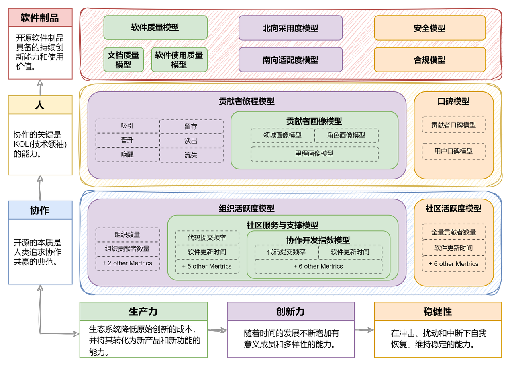
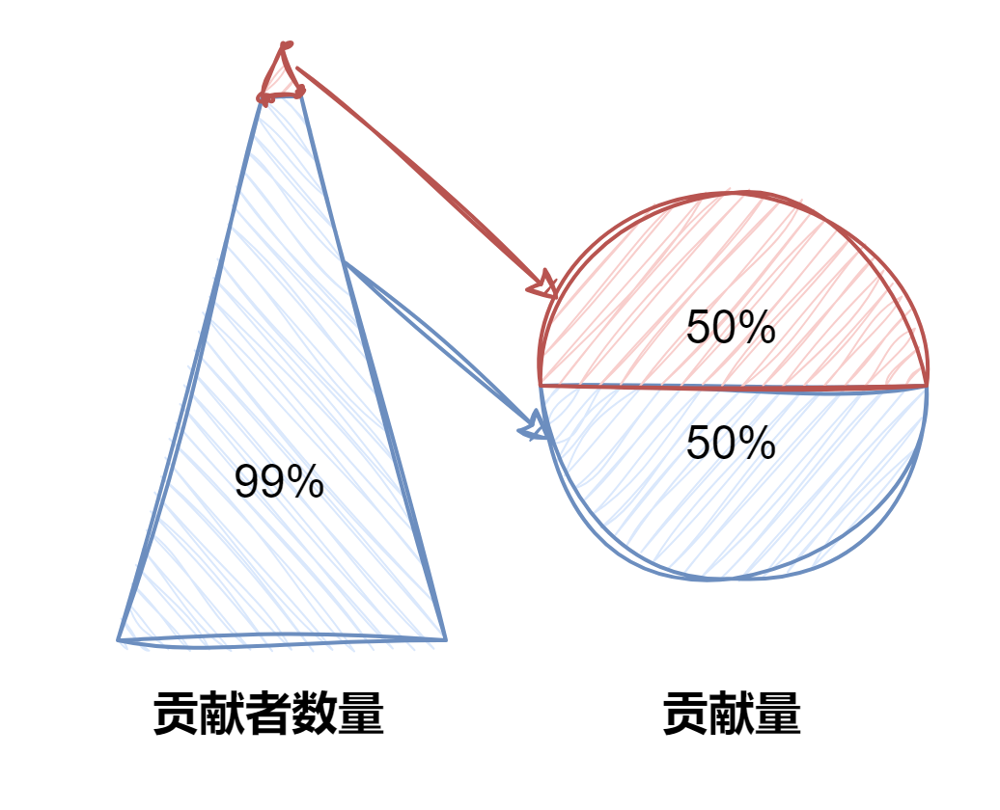
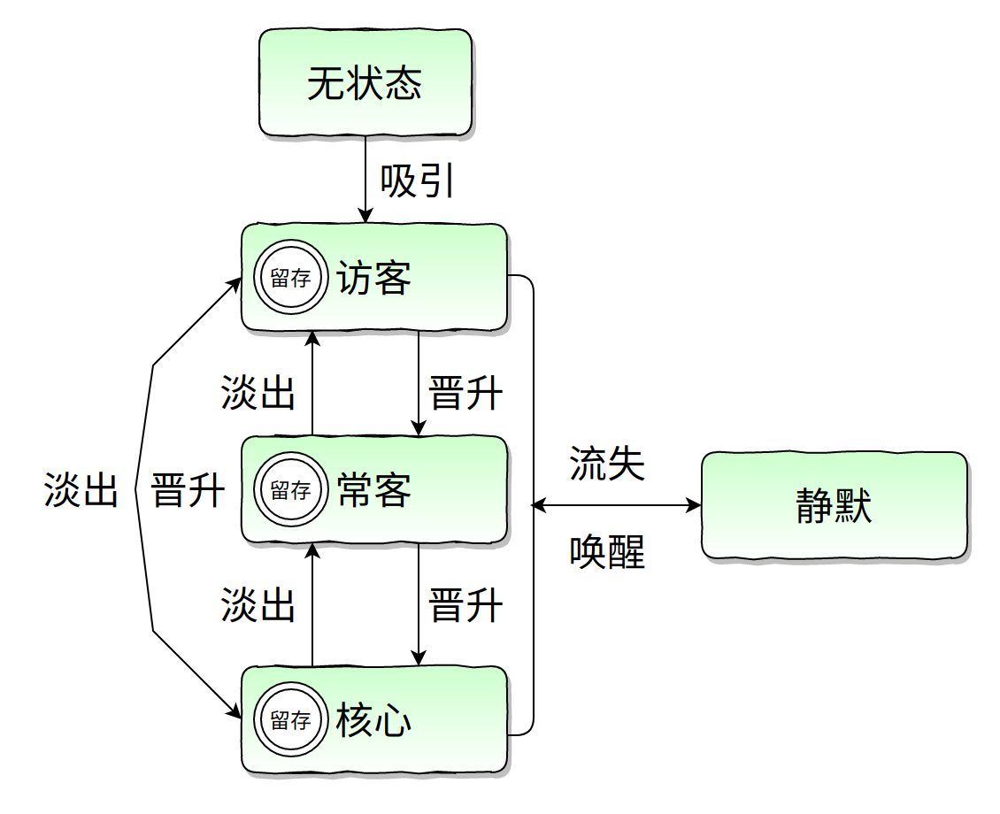
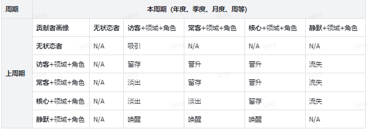

在之前的两篇文章《开源生态评估与度量的思考（一）——演进与趋势》和 《开源生态评估与度量的思考（二）——评估体系的多维空间》中， 我总结了开源社区评估与度量的三个主流方向：开源软件、开源项目和开源生态。以及评估体系的三维空间（图一），在“开源生态”与“协作”两个维度交织空间中，介绍了四个评估模型协作开发指数模型、社区服务与支撑模型、组织活跃度模型和社区活跃度模型（已在 OSS-Copass 部署）， 并使用 Pytorch vs Tensorflow 实例来展示几个模型间的逻辑关系。

在这篇文章中，我们将主要介绍“开源生态”与“人”之间的交织产生了两个重要的评估模型：贡献者画像模型和贡献者旅程模型。这两个模型是与南京大学汪亮老师及其团队共同研究的成果，在此衷心感谢汪亮老师和他的团队为此付出的努力。

<!--truncate-->

  

图一

  

### 为什么要构建这两个模型 ？- 三个问题

贡献者作为开源社区的创新源动力，一直是从事社区可持续发展研究领域的重点课题。贡献者是谁，他们的贡献和在社区的轨迹如何描述，以及由此带来的正向或者负向的影响如何感知和评估，一直是一个经久不衰的话题。 经过过去半年的整理和总结，我们确定了三个有前后依赖关系的研究问题，并采用工程化的方法进行解决，以确保实际可操作性和对具体问题的实际意义。
首先，让我们介绍这三个问题：

#### 1. 如何描绘贡献者画像？

在不侵犯个人隐私的前提下，贡献者画像应该包含哪些维度？通过收集哪些数据，可以尽可能将画像信息正交化和原子化，为后续针对贡献者的各种研究提供准备。

#### 2. 如何描述贡献者在（跨）社区中的旅程？

在研究贡献者时，我们经常使用一些熟悉的术语，如活跃度、留存率、晋升和流失等，这些术语常用于描述贡献者在社区中的行为轨迹。然而，我们需要深入了解贡献者在社区中的行为包含哪些典型动作，并探索这些轨迹是否存在联系。通过跨社区的轨迹追踪，我们甚至可以进行行业和趋势观察。

#### 3. 这两个模型的价值是什么？

这个问题是我们研究贡献者的最终目标，与构建开源评估体系的整体目标一致。这些模型的应用将有助于社区治理、发现高价值社区以及预测产业趋势等方面。在接下来的文章中，我们将逐步介绍如何利用这些模型实现这些目标。

我们将通过构建模型来解决前两个问题，第三个问题则基于模型构建和工程实现的成果，结合我们的洞察力进行综合分析和总结。本文的重点将放在前两个问题上，即贡献者画像模型和贡献者旅程模型。"

### 贡献者画像模型

贡献者画像模型旨在描述参与开源社区各类贡献的人员。在这里，我们更倾向于使用贡献者这个术语，以包含所有参与者的范围，而不仅限于代码贡献的软件工程师。

我们通过三个维度来刻画贡献者画像（图二）：领域画像、角色画像和里程画像，，以实现这些维度之间的正交关系。这样，我们可以形成一个全面的描述，例如："阿强是一位以个人管理者(角色画像)身份参与社区贡献的贡献者，主要参与代码和论坛（领域画像）相关的贡献。目前，他是社区的核心贡献者（里程画像）。"

  

图二

  

#### 领域画像模型

在领域画像模型中（图三），我们首先将贡献者为社区做出的贡献按领域或类型进行划分。我们力争将贡献领域划分得更加原子化，以与我们当前的工程能力相匹配。然而，这个划分过程是一个持续演进的过程，随着我们工程能力的提升，我们将能够实现更细粒度的领域划分。

对于观察类贡献、Issue 类贡献和 Code 类贡献，我们可以利用代码托管平台（如 GitHub、Gitee 等）提供的数据来获得洞察。对于其他几类贡献，由于社区使用方式和程度的差异，我们目前只能提供有限的数据源作为参考。然而，随着我们工程能力逐步提升，我们可能会提供更多解决方案。

  

图三

  

- 观察类贡献：贡献者通过 star、fork、watch 对项目予以关注，由此可以提升和展现项目受关注的程度，但对项目没有直接贡献。

- Issue 类贡献：Issue 类型的贡献，根据问题的类型，可分为：使用咨询、Bug 上报、任务规划等。 但我们目前还没有一个通用的解决方案去甄别问题的类型。所以我们根据贡献者在 Issue 中产生的行为，对贡献做了两个类型的划分，常规贡献和管理贡献：

  - Issue 常规类贡献：Issue 创建、评论。

  - Issue 管理类贡献：Issue 标签、关闭、重新打开、分配责任人、标记重复、迁移、里程、评论锁定等 8 种管理行为。虽然这些贡献往往被忽视，但实际上是社区管理者花费大量时间以保证 Issue 处理流畅的重要行为，因此我们应该纳入观察范围。

- Code 类贡献：与 Issue 类贡献类似，我们将 Code 贡献行为分为，常规贡献和管理贡献：

  - Code 常规类贡献：Code 开发，Pull Request 创建、Code Review。

  - Code 管理类贡献：Code 直接提交，以及 Pull Request 标签、关闭、重新打开、分配责任人、标记重复、迁移、里程、评论锁定、合并、审查等 10 种管理行为。这些管理行为如同 Issue 管理类贡献一样，同样花费了社区管理者大量精力，来确保代码能够顺利合入。

- 论坛类贡献：开源社区如果基于 Discourse 等提供公开获取数据渠道的框架构建论坛服务，我们就可以洞察论坛的贡献行为，例如论坛的 Topic 创建、评论。

- 聊天平台类贡献：我们支持基于 Slack、Discord 等作为聊天平台的数据考察方式。

- 媒体平台类贡献：目前我们的数据主要来自于 Twitter。

- 活动类贡献：当前我们的数据依赖手动输入，包含线上和线下活动。

- Sponsor：现金类的捐赠。

#### 角色画像模型

开源项目的发起通常是由一个团队或者个人，以个人身份或者组织身份发起创立，在演进过程中不断吸纳新的个人或者组织参与贡献。 不论是初创者，还是后来加入者，通过与社区建立双赢的合作，以及突出、持续的贡献，获得了社区管理者的角色，这个角色通常可以通过行使一些在代码托管平台的管理行为，得以展现。我们也是通过这类事件行为来确认贡献者是否拥有管理者角色。 而没有被觉察到管理行为的贡献者，我们称之为参与者。

我们使用管理者这一术语来描述社区中拥有管理权限的贡献者。通常情况下，他们也是项目的技术领导者。然而，技术领导者并不能完全等同于管理行为，所以我们采用管理者这个更加具体的称谓。

判断贡献者是否为管理者的标准是其是否做出了 Issue 管理类贡献或 Code 管理类贡献。当然，一个贡献者可能在最初参与社区贡献时并不是管理者，因此我们引入了时间戳来标记这一身份的变化。在上述两类贡献中，如果贡献者声明了自己的组织身份，例如通过公开的组织邮箱直接强制提交代码，我们称其为组织管理者；反之称其为个人管理者（见图四）。

  

图四

  

- 管理者：

  - 组织管理者
  - 个人管理者

- 参与者
  - 组织参与者
  - 个人参与者

#### 里程画像模型

贡献者可能基于上下游生态利益或个人发展等原因与开源项目产生共鸣，并进入社区参与贡献。他们可能长期留在社区，逐渐淡出，甚至再次被唤醒。基于这些情况，我们定义了贡献者在社区中的多种状态，构成了里程画像。这个模型受到状态机的启发，每个状态之间可以相互迁移，而贡献者同时只能处于一种状态。这样做可以确保行为的解耦，更有利于观察贡献者在社区中的行为。

  

图五

  

我们根据贡献者在社区的贡献量、贡献频率、贡献类型以及他们的状态，将贡献者里程在考虑时间周期的同时，划分为如上 5 种状态（图五）：无状态、访客、常客、核心以及静默。以年度为例，这里给出五种状态的定义：

- 核心： 指贡献者在本年度完成了所有领域贡献的 50%（不包括观察者类贡献，如 star、fork、watch）。这些贡献由最少得一组人完成，该组人被称为核心贡献者。所有领域贡献不进行加权处理，只统计次数。
- 常客：排除核心贡献者所贡献的 50%之后，接下来的 30%贡献（不包括观察者类贡献，如 star、fork、watch），由至少一组人完成。这些人及在本年度中至少参与了 9 个月的贡献，被称为常客贡献者。
- 访客：排除核心、常客贡献后，参与社区剩余贡献的人（包含观察者类贡献，即 star、fork、watch），称之为访客。
- 静默：本年度之前活跃的核心、常客或者访客，本年度没有任何贡献的人。
- 无状态：从未在本社区做出贡献的人。

#### 帕累托原则的思考：1% 与 99%

在里程画像中，我们主要使用帕累托原则(注：这里的帕累托原则，不是具体的二八比例，而是少数贡献者为项目做出了绝大多数的贡献)作为一个度量标准，具有以下优势：

1. 客观性和可测量性：贡献百分比是一个客观且可测量的指标，可以直接从数据中获取。
2. 经验验证：通过多年来对大型开源社区数据的观察，我们发现贡献次数呈现出帕累托原则，即少数人完成了绝大部分的贡献。这证实了贡献次数作为衡量贡献者重要性的一种有效方式。
3. 我们引入了时间周期维度，避免长期参与社区的贡献者在累积贡献次数上可能比新加入的贡献者更具优势。这可能会使一些有潜力的贡献者被忽视。

核心贡献者的定义采用了 50%这个比例，这是基于我们对多个大型开源社区在过去十几年的数据观察得出的结论。毫无疑问，所有这些社区都符合帕累托原则，即由极少数人完成了绝大部分的贡献。根据我们对超过五年的代表性开源社区数据的观察，如图六所示，1%的人完成了 50%的贡献。更详细内容，我准备在后续的文章再做详细介绍。

但是我们也意识到使用帕累托原则无法完全衡量贡献者的价值，我们鼓励综合考虑其他因素，如代码质量、问题解决能力、对社区文化的影响等，以得出更全面和准确的评估结果。通过不断优化和改进我们的评估体系，我们可以更好地理解和利用开源生态系统中不同参与者的价值，促进可持续发展和创新。

  

图六

  

### 贡献者旅程模型

#### 从静态到动态

我们回顾一下贡献者画像模型描述的一个典型场景：阿强, 以个人管理者（角色）身份参与社区贡献，主要参与代码和论坛（领域）相关贡献，目前是社区的核心贡献者（里程）。而这只是他在社区中的当前状态。然而，我们应该思考，阿强一开始是否就是个人管理者？也许他最初只是一个普通的贡献者，但由于长期的持续贡献，社区为他提供了晋升渠道，并认可他的价值，从而使他成为管理者。

我们还需要考虑核心贡献者是否会流失，以及这对社区产生的影响和可能的原因。流失可能是由多种因素引起的，例如缺乏动力、时间压力、参与感减退或是被其他类似社区吸引。当核心贡献者流失时，社区可能面临知识流失、项目进展缓慢、活跃度下降等问题。

接下来，我们将视角转向组织身份。当一家组织加入社区时，我们需要思考它何时委派员工参与、主要贡献的领域以及其对社区的需求。此外，我们也要了解组织何时增加对社区的投入，并在何时逐渐减少投入。这种减少可能是因为出现了更有价值的类似社区，或者整个生态系统出现了替代者。

总结起来，上述描述构成了一个动态过程，我们需要结合贡献者画像、行为特征和时间维度来描绘贡献者旅程模型。通过这个模型，我们能够逐步了解在一个社区中个人和组织的变化趋势，以及整体社区的轨迹变化。这样的分析可以帮助我们更好地评估开源生态系统并获得洞察，进而促进可持续发展和创新。

#### 画像与旅程模型的关系

我们用旅程来表征个人或者组织在一个社区的转换状态或者称之为轨迹。它首先与画像模型中的里程模型紧密相关，例如一个贡献者经过一年的贡献，他的贡献量达到了年度核心贡献者的标准，那么他就从之前的一个里程状态晋升为核心贡献者。这里我们用图七进行展示，每个箭头的索引其实就代表了贡献者旅程的变化类型。

  

图七 里程画像模型+旅程模型

  

然而，贡献者的评估不能仅仅看贡献量或频率，还需要考虑其他身份因素（画像）。例如，我们需要了解贡献者在社区中主要贡献于哪些领域（例如代码、论坛等），以及他成为核心贡献者的角色是代表个人还是组织，并是否具有社区管理者的权限。我们可以通过图八来展示这些身份因素。

  

图八 画像模型+旅程模型

  

#### 七个状态

在贡献者旅程的状态迁移定义中，我们通过一个表格来具体描述了不同周期之间的状态转换。这些状态转换根据贡献者的画像主要基于里程模型，并辅以领域和角色画像。请注意，根据需求，我们可以选择其他主要的画像来进行描述，但本文将重点放在里程画像上。

  

表一 贡献者旅程状态定义

  

吸引：贡献者从上周期的无状态者成为本周期的访客，此种状态迁移称之为吸引。

留存：贡献者上周期与本周期活跃的画像状态（访客、常客、核心）没有发生改变，此种状态迁移称之为留存。

晋升：贡献者从上周期的某个活跃的画像状态（访客或者常客），由于贡献量或者频率的提升，晋升为常客或者核心，此种状态迁移称之为晋升。

我们的晋升通道是否是通畅的？是否有越多的贡献者建立与社区的双赢价值联系？

淡出：贡献者从上周期的某个活跃的画像状态（核心或者常客），由于贡献量或者频率的下降，退变为常客或者访客，此种状态迁移称之为淡出。

流失：贡献者从上周期的某个活跃的画像状态（访客、常客、核心），在本周期不再活跃，退变成静默，此种状态迁移称之为流失。

唤醒：贡献者从上周期的静默，本周起再次进入到某个活跃状态（访客、常客、核心），此种状态迁移称之为唤醒。

活跃：本周期通过吸引、留存、晋升、淡出、唤醒进入访客、常客、核心状态，统称为活跃。

以上这七种状态是构成贡献者旅程的关键要素，但并不建议立刻去关注所有状态，一定要因地制宜。例如社区成立之初，我们更关注贡献者的吸引，当进入到某个阶段，如何建立与核心贡献者的双赢关系又变成重中之重，此时核心开发者的留存和流失是我们关注的重点。

### 总结与后续

通过《开源生态评估与度量的思考（2）——评估体系的多维空间》和本篇文章，我们完成了“开源生态”与“协作”交织的四个模型（协作开发指数模型、社区服务与支撑模型、组织活跃度模型和社区活跃度模型），以及“开源生态”与“人”交织的两个模型（贡献者画像模型、贡献者旅程），总计六个模型的讲解已为我们打下了坚实的基础。

对模型的介绍暂时告一段落，在接下来的系列文章中，我将以评估体系为依托，对几个开源产业领域进行深入分析和洞察。

本系列文章为王晔晖原创，采用知识共享许可协议 CC-BY-NC-SA 4.0 进行公开，如需转载或使用请联系原作者yehui.wang.mdh@gmail.com。
