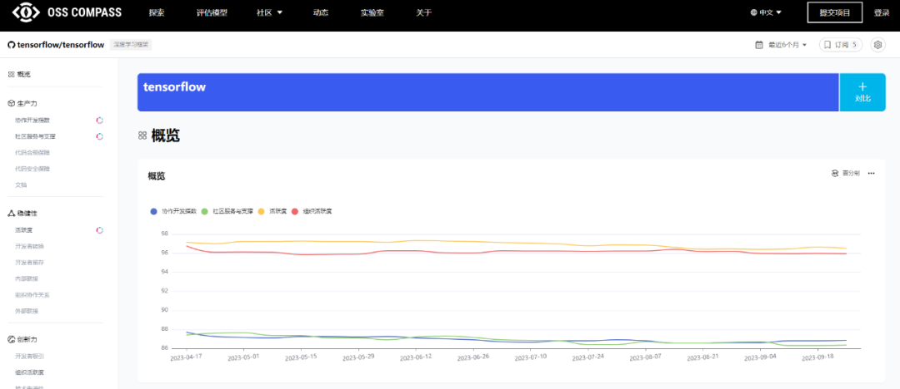
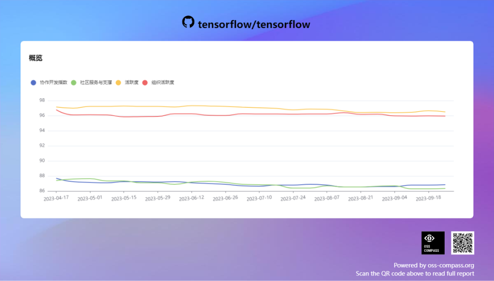
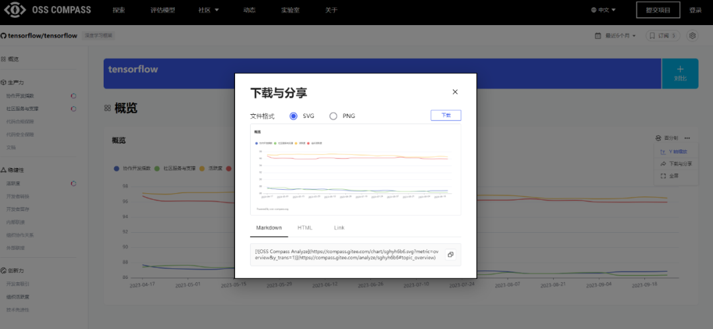
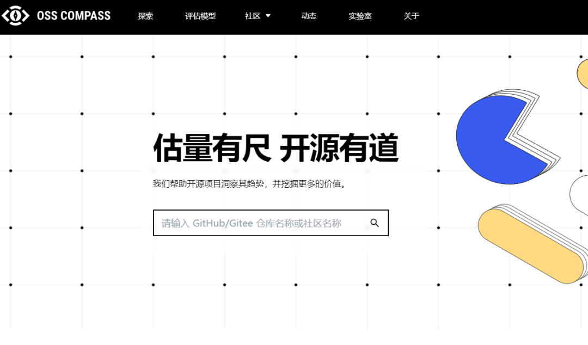
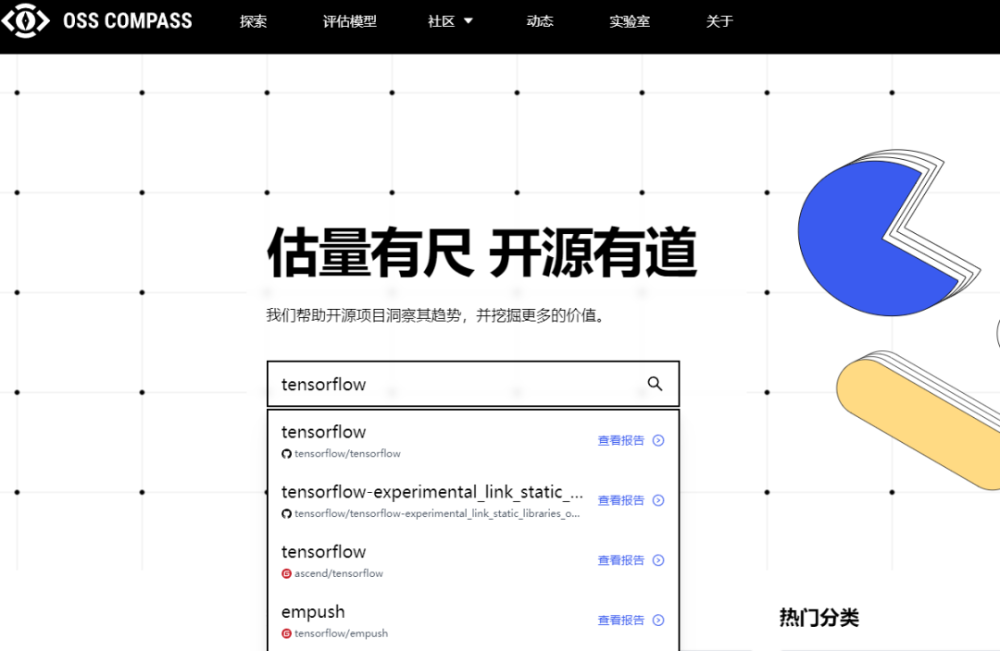
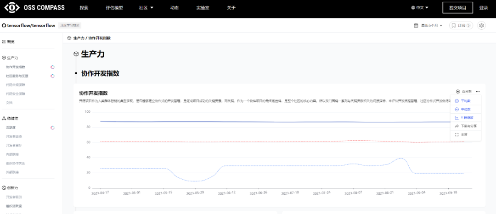
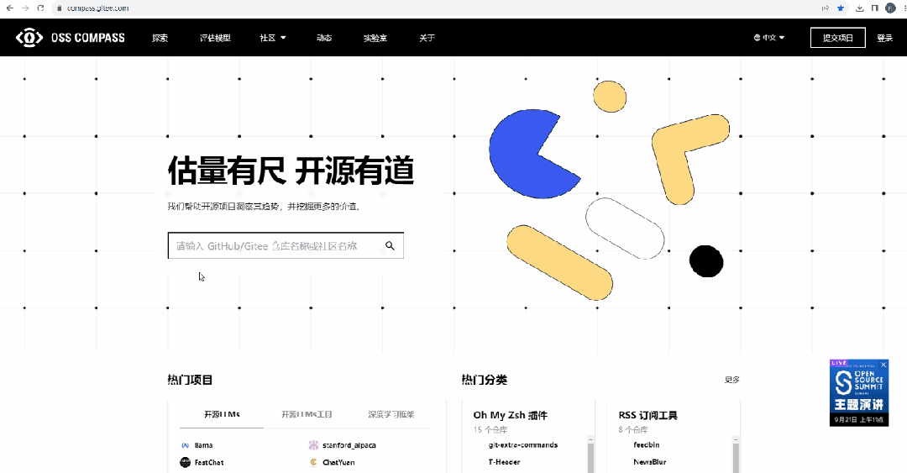

嗨，亲爱的 OSS Compass 用户们！又到了一期“OSS Compass 新功能大揭秘”的时间啦！今天，我们将为大家介绍一项崭新的功能，这可是应用户的热烈请求，让 OSS Compass 的项目报告页更强大、更灵活的一个新功能！废话不多说，赶紧来看看吧~

<!--truncate-->

### 01 项目报告页回顾

不知道大家是否还记得不久前我们曾经介绍过 OSS Compass（以下简称“Compass”）的项目报告页（dashboard），那个让你一键了解项目发展趋势的神奇页面。嗯嗯，没错，就是下面这个页面！

你只需要在 Compass 官网搜索你的项目，然后点击它就可以进入项目报告页了，所有的项目数据都会以直观的图表形式呈现在你的眼前。这样一来，你就可以轻松地了解你的项目在各个方面的发展情况。而且，还可以一键下载这些图表，方便你的项目报告分析。

### 02 用户的创意点子

但是，两个多月前，我们收到了一位用户的请求。这位用户想要的不仅仅是静态图表，他希望能够将特定的指标图表嵌入自己的网页，并且实时获取最新的数据。也就是说，他要的是一张“活”的图表，而不是一张“死”的。

你可能会问，什么叫做“一张活的图表”呢？简单来说，就是当你在网页上嵌入这个图表后，它可以实时更新，告诉你最新的数据情况。而不是像之前的下载功能那样，每次都是一张死的图表，不会再变了（比如上图）。

这位用户简直就是 Compass 社区的铁杆粉丝，总是促进我们追求极致！

### 03 工程师行动

我们的工程师团队听到了这个需求，毫不犹豫地行动起来。在社区技术例会中，大家一拍脑袋，决定以最快的速度来实现这个功能，满足用户的愿望。

但要实现这个功能可不容易，因为 Compass 分析了超过 5 万个项目，每个项目有几十个评估指标，这就需要创建大量的 URL 链接，还要保证这些链接里的 svg 格式图片能够实时更新。

听起来有点可怕，但是我们的工程师团队太强大了！我们一直都在努力，为的就是能够给大家带来更好的体验！

### 04 新功能上线

现在，好消息来啦！我们终于实现了这个功能，让你可以自由选择某个指标的图表，将它以链接的形式嵌入你自己的网页，并且随时获取最新的数据。

现在，好消息来啦！我们终于实现了这个功能，让你可以自由选择某个指标的图表，将它以链接的形式嵌入你自己的网页，并且随时获取最新的数据。

### 05 如何使用新功能

是不是很激动？是不是等不及要试一试了呢？别急，下面先来看看操作步骤：

#### 1. 进入 Compass 官网，搜索你感兴趣的项目

在网站首页搜索框中输入你感兴趣的项目名称或关键词，然后点击搜索按钮。

#### 2. 点击项目名称进入报告页

在搜索结果中找到你要的项目，点击项目名称，进入项目的报告页。

#### 3. 选择你想要的图表，点击“下载与分享”

在报告页中，你可以看到各种各样的图表，展示了项目的各项指标。现在，你可以选择你想要的图表了。一旦你选择了图表，找到图表右上方的“下载与分享”按钮，点击它。

#### 4. 复制链接并嵌入到你的网页中

弹出的窗口中会显示几个链接，选择你想要的那个，复制它，然后粘贴到你的网页代码中的合适位置。

  

我们提供了三种链接形式：Markdown、HTML 以及 Link

  

#### 5. 享受实时更新的图表

现在，你的网页上就嵌入了一个活的图表！它会随着数据的变化而实时更新，让你的网页变得更加生动和有趣。

是不是很简单？亲爱的 Compass 用户们，别犹豫了！快来试用这个全新的功能，让你的项目数据活起来，让你的报告更有活力!

### 06 结语

我们真的很高兴能够为大家带来这个功能，希望它能够让你的数据分析和报告工作变得更加轻松有趣。如果你有任何问题或建议，都欢迎在评论区留言或者随时联系我们。Compass 团队会一如既往地倾听你的需求，为你的开源项目提供更多便捷、实用的功能。

感谢大家一直以来的支持和反馈，让 Compass 变得越来越强大！我们将继续努力，为大家带来更多好玩的功能，让你的数据分析之路更加精彩！

记得关注我们的公众号，不要错过任何更新哦！继续享受开源之旅，让 Compass 为你护航！开源，我们一直都在路上！😄🌟
