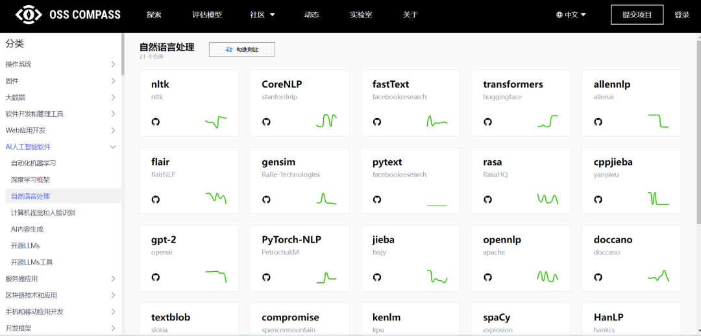
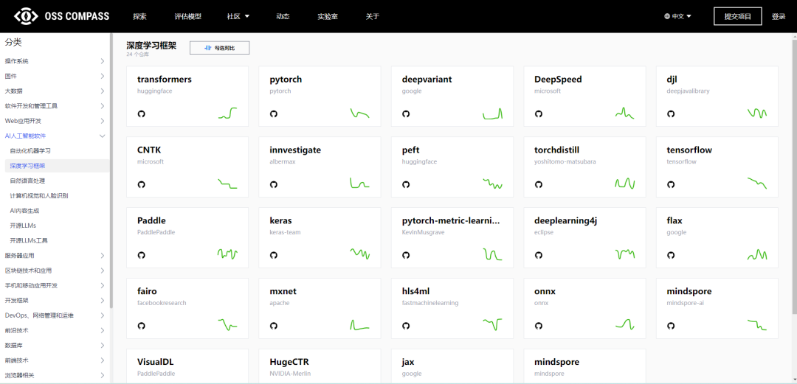

import jpg1 from './media/1.jpg';
import jpg2 from './media/2.jpg';
import jpg3 from './media/3.jpg';

;

<!--truncate-->

嗨，大家好！“OSS Compass 功能更新”系列文章已为大家揭开了“Compass 徽章”、“Dashboard 图表 Y 轴缩放功能”和“Compass 分制切换及算法”、“Compass 实验室”的神秘面纱。今天，小编又给大家带来 OSS Compass（简称“Compass”）社区的新功能了！

最近，一位 Compass 的用户提出了一个小小的愿望，但它将为大家带来巨大的方便，它就是——现在你可以在 Compass 官网上，直接点击项目下面的仓库图标，就能跳转至仓库了！

### 01🌟 用户愿望，Compass 响应

不久前，一位热心的 Compass 用户提出了一个建议，希望在官网上能够更便捷地访问项目的仓库。我们一直秉承着用户至上的理念，于是，Compass 社区立刻行动起来，将这个小小的愿望变为现实。

### 02🌟 功能实现，一触即发

Compass 的开发者们一直在为社区不断努力，他们在繁忙之时，也总会把用户的需求放在心上。很快，这个功能就实现了！要知道，Compass 已收录 2 万+项目，实现这个小小的功能也需要不小的工作量呢~

### 03🌟 操作演示，让你秒懂

让我们来看一下如何使用这个新功能吧！

首先，打开 OSS Compass 官网，进入探索页面，找到你感兴趣的项目。然后，在项目名称下方，你会看到 Github 或者 Gitee 图标。只需轻轻一点这两个图标，你就能直接跳转至仓库页面！简单吧？

### 04🌟 小功能，大便利

或许有人会觉得这只是一个小小的功能，但它却为 Compass 的用户带来了极大的方便。如果你要查看多个项目的仓库，以前可能需要一个个手动搜索。现在，不再需要了！这个小小的按钮，也许会为你节省不少宝贵的时间呢！

### 05🌟 探索分类，更多精彩

前面提到 Compass 已收录 2 万+项目，这里要特别提一下 Compass 官网的项目分类工作。Compass 社区新晋董事奇科厚德龙文选及其团队就一直在致力于此项工作。

目前，我们已经有了 270 多个分类，为用户了解更多项目提供了大大的便利。如果你想通过分类来查询项目，只需在探索页面右侧点击“更多仓库”，就会跳转至分类页面。

在分类页面中，你将会发现更多的项目等待你的探索。同样，分类页面的项目也都支持点击 Github 或 Gitee 图标跳转至仓库哦！

不管你是开发者、项目负责人还是对开源项目感兴趣的用户，Compass 都致力于为你提供更好的体验和更多的便捷功能。我们将一直保持对用户需求的敏感，并不断为你们带来更多的惊喜。

快来试试这个新功能吧！让 Compass 官网成为你发现优秀开源项目的最佳伙伴，让你的开发之路更加高效愉快！感谢你一直以来的支持，我们将继续努力，为你呈现更多精彩！
