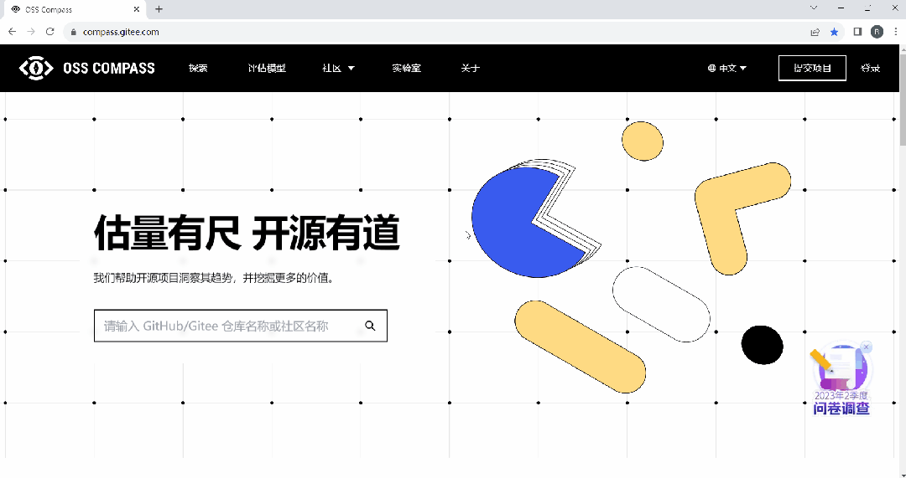

<!--truncate-->

上一期“OSS Compass 功能更新：Compass 徽章”中提到了 Dashboard。今天即将介绍的 Y 轴缩放功能与 Dashboard 息息相关~

### 01 Dashboard 是什么

提交到 OSS Compass（以下简称“Compass”）的开源项目通过 Compass 社区健康度评估模型分析后，就会生成该项目专有的 Dashboard 页面。这个页面以图表的形式，呈现了项目总体及各项评估指标的变化趋势。在 Compass 官网的“探索”页面，点开一个开源项目，就会立刻跳转到它的 Dashboard 页面。快去试试吧~

  

打开 Dashboard 操作演示

  

### 02 打开 Dashboard 操作演示

Y 轴缩放功能与 Dashboard 到底是什么关系？其实“Y 轴缩放”就是 Dashboard 页面右上角的设置图标下的一个按钮。Dashboard 页面的图表是以横轴、Y 轴之间的曲线变化表达指标变化趋势的。现在“Y 轴缩放”成为一个单独的选项供用户自由选择 Y 轴缩不缩放。

### 03 Y 轴缩放功能怎么用

这个“Y 轴缩放”功能到底是咋用的呢？简直不要太简单！在 Dashboard 页面右上角的设置图标下找到“Y 轴缩放”，点它：当这个选项显示为蓝色时，Y 轴为放大状态；当这个选项显示为灰色时，Y 轴为缩小状态。请看下面演示操作~

  

如何使用 Y 轴缩放操作演示

  

看上去缩不缩放曲线差别真的有点大呢！

### 04 The Story Behind the Implementation of Y-axis Scaling

Compass 发布之初，Dashboard 还不支持 Y 轴缩放功能。为什么现在又支持了呢？这事儿还得从一段 Slack 对话说起。
Our technical experts responded, "The Y-axis initially started from zero, but after some time, they realized that the curves didn't change much although there were some numerical changes in reality. If these changes couldn't be reflected, it would be meaningless for the analysis results. Do you have any suggestions for us?"

一位国外的用户说，他发现有些指标的曲线乍一看上去变化很大，数据好像变差了，他第一反应是“Oh, my god”，瞬间感觉不好了。再仔细看却发现数值变化其实很小，只是因为 Y 轴不是从 0 开始、间隔值比较小而已。

我们技术专家回应，一开始 Y 轴是从 0 开始，结果过了一段时间发现曲线没多大变化，实际上数值是有一些变化的，如果不能体现变化，没法做比较，这个分析结果也就没啥意义了，你有啥好建议跟我们说说啊。

这位用户建议，你们是不是可以考虑加一个按钮，让用户自由选择每个图表的 Y 轴缩不缩放啊？

我们技术专家说，可以考虑。

10 天以后，我们就实现了这个功能，这位用户欢天喜地用起来了~

Compass 的用户们，你们还有啥需求，赶紧提过来吧~

你们的需求，我们将尽力满足~图片
