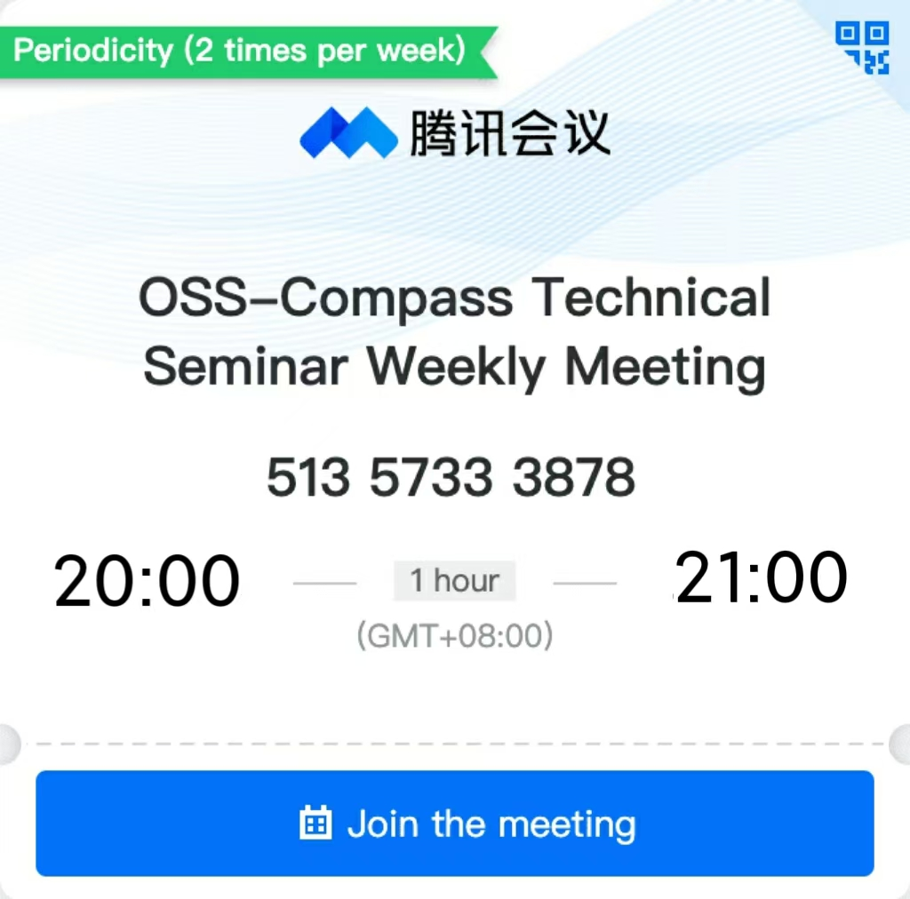

我们定期举行线上技术研讨会，围绕评估模型、OSS Compass SAAS 服务演进进行讨论和决策，欢迎通过在线会议与我们一同交流你的想法。

- **会议主题**：OSS-Compass 技术研讨周会
- **会议时间**：北京时间每周二 20:00-21:00 (GMT+08:00)
- **腾讯会议号**：513-5733-3878

如果点击按钮无效，你可以复制点击或复制以下 URL 到浏览器。

:::info 参加 OSS-Compass 社区研讨周会

<https://meeting.tencent.com/dm/AE8RoTY40SfS>

:::

:::info 查看 OSS-Compass 社区研讨周会会议纪要

<https://gitee.com/oss-compass/community-zh/blob/main/meeting%20minutes/meeting-minutes_Zh-CN.md>

:::
